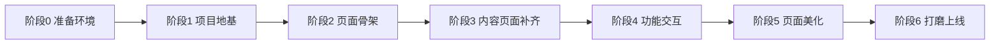
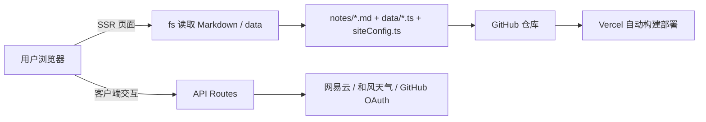

# EverlastingDemo 可复现高还原项目实现指南

> **定位**：一份从 0 到 1 搭建 **EverlastingDemo**（基于 XHBlogs 参考项目高还原的个人博客）的完整实现指南。整合了《项目分析指南》《EverlastingDemo-独立前端实现策略技术文档（优化版 v2.1）》《EverlastingDemo-审核报告与优化实现计划（优化版 v3.1）》三份文档。
>
> **目标读者**：会基础 React/TypeScript 的前端开发者；无需 Python、无需管理端、无需数据库。
>
> **可信度**：所有关键事实均对照 `C:\Users\16037\Desktop\front\个人主页参考\XinghuisamaBlogs\XHBlogs` 源码逐一核实（标注 `[已观察]`）；可复制命令与代码按 2026-08-04 复核时的版本编写。
>
> **版本**：v1.1（整合版 · EverlastingDemo） | **日期**：2026-08-04
>
> **范围说明（2026-08-04）**：AI 猫猫（CyberCat / `app/api/chat` / Gemini / `GEMINI_API_KEY`）已按需求**完全移除**，本指南所有搭建步骤、功能矩阵、依赖与环境变量清单均不再包含该功能；后续如需恢复可参考原项目代码。
>
> **内容整合修订（2026-08-05，v1.2）**：已决定将「说说 /moments」「杂谈 /chatter」「文章 /posts」整合为统一「杂谈」模块（`notes/` 单一目录 + kind 区分 + 本地编辑器），完整方案见《EverlastingDemo-内容整合企划书-杂谈统一模块.md》。本指南中与内容模型、路由、更新工作流相关的章节已同步标注"整合前/整合后"。

---

## 目录

0. [实施路线总览（先看这里）](#第〇章实施路线总览先看这里)
1. [项目认知](#第一章项目认知)
2. [从 0-1 搭建](#第二章从-0-1-搭建可复现)
3. [UI 实现过程（高还原）](#第三章ui-实现过程高还原)
4. [API 代理层](#第四章api-代理层)
5. [部署与发布](#第五章部署与发布)
6. [功能矩阵与裁剪指南](#第六章功能矩阵与裁剪指南)
7. [常见问题排查](#第七章常见问题排查)
8. [审核结论与优化清单](#第八章审核结论与优化清单)

---

# 第〇章：实施路线总览（先看这里）

> 本章回答一个问题：**从哪里开始？** 核心思路是"先内容后颜值、先功能后特效"——把粒子、3D、弹幕这类高内存高 CPU 的花哨效果统一放到**最后的页面美化阶段**，前期只搭"能跑、能看、能点"的地基。

## 0.1 一条主线：六阶段推进



## 0.2 各阶段做什么 / 不做什么 / 验收标准

| 阶段 | 目标 | 做什么 | 不做什么 | 验收标准 | 预计耗时 |
|------|------|--------|----------|----------|----------|
| 0 准备环境 | 工具就绪 | 装 Node.js 20.9+/Git/VS Code；注册 GitHub/Vercel | 不装任何 npm 包 | `node -v` / `git -v` 正常 | 30 分钟 |
| 1 项目地基 | 项目能启动、内容能读 | 初始化项目、精简依赖、配置文件、siteConfig、目录骨架、第一篇 hello-world.md、lib/markdown.ts 渲染管线 | 不做任何特效、不做导航轮盘、不做音乐/评论 | `npm run dev` 启动；首页能看到文章卡片；文章详情页能渲染 Markdown | 1-2 小时 |
| 2 页面骨架 | 核心页面完整可浏览 | 基础 Provider（主题/Toast）、全局布局基础版（渐变背景 + 毛玻璃）、桌面导航、首页（名片 + 文章轮播 + 数据面板）、文章详情页、关于页 | 不加粒子/弹幕/樱花/工具箱/浮动播放器；首页音乐卡片可先占位 | 首页/文章/关于三页完整；暗亮切换生效；导航可跳转 | 2-3 小时 |
| 3 内容页面补齐 | 导航所有入口都有落地页 | 杂谈详情、说说、时间线、友链、项目、照片墙 | 不做搜索/评论/音乐交互（页面可先静态展示数据） | 导航 10 个链接全部有页面；数据正常显示 | 2-3 小时 |
| 4 功能交互 | 常用交互可用 | 搜索、评论（Gitalk）、音乐系统（含播放器）、天气挂件（均按需） | 不做任何装饰性特效 | 每个功能独立可开关、无报错 | 每项 1-2 小时 |
| 5 页面美化 | 视觉拉满（后置） | 粒子背景（Three.js）、3D 模型、弹幕、樱花/萤火虫/飘雪/风吹草、点击波纹、闪屏动画、工具箱、光晕调优 | 不动内容/数据/路由逻辑；一次只加一个效果并验证性能 | 每个效果可单独移除；桌面端帧率与内存可接受 | 0.5-1 天 |
| 6 打磨上线 | 可对外发布 | error/not-found/loading、SEO metadata、性能检查、GitHub+Vercel 部署、环境变量、自定义域名 | - | 线上可访问；push 新文章自动更新 | 半天 |

## 0.3 三个核心原则

1. **先数据后颜值**：第一篇文章能渲染、配置能生效，比任何动画都重要。地基阶段即使页面"朴素"，也是可用的。
2. **先功能后特效**：特效与内容渲染完全解耦（特效只是 layout/组件树里的独立组件），最后叠加不影响前面任何成果，还能随时单独关掉。
3. **每阶段都有验收点**：阶段 2 完成即可部署上线一个"能读文章的个人主页"；阶段 4 完成即功能完整；阶段 5 只负责"更好看"。

## 0.4 哪些算"美化后置"，哪些是"风格底色"

- **风格底色（阶段 2 就做，CSS 轻量）**：毛玻璃卡片公式、渐变流动背景、白色遮罩/光晕、暗/亮主题、字体。这些是"一眼就是 XHBlogs"的根本，不占内存。
- **美化后置（阶段 5 做，重资源或装饰性）**：Three.js 粒子、3D 模型（spaceship.bin）、弹幕、樱花/萤火虫/飘雪、点击波纹、闪屏动画、工具箱、光晕调优。
- **功能优先（阶段 3-4）**：内容页面、搜索、评论、音乐播放、天气挂件。音乐虽是重资源但属于功能，放阶段 4，且 `cloudMusicIds: []` 可随时关闭。

## 0.5 三个目标版本对照

| 版本 | 包含 | 不包含 |
|------|------|--------|
| 最小可跑集（阶段 0-2） | 首页 + 文章 + 关于 + 主题 + 导航 + 渐变背景 | 粒子/弹幕/音乐/评论/搜索/工具箱 |
| 功能完整版（阶段 0-4） | 以上 + 全部内容页 + 搜索/评论/音乐 | 粒子/弹幕/樱花等装饰特效 |
| 高还原完整版（阶段 0-6） | 全部 | - |

## 0.6 阶段与指南章节对照

| 阶段 | 对应指南章节 |
|------|-------------|
| 0 准备环境 | 第二章 §2.1 |
| 1 项目地基 | 第二章 §2.2-§2.10 |
| 2 页面骨架 | 第二章 §2.5-§2.6 + 第三章 §3.1-§3.5、§3.7、§3.14 |
| 3 内容页面补齐 | 第三章 §3.6、§3.8 |
| 4 功能交互 | 第三章 §3.10、§3.12-§3.13 + 第四章 |
| 5 页面美化 | 第三章 §3.2（覆盖层）、§3.9、§3.11 + 第六章 |
| 6 打磨上线 | 第五章 + 第三章 §3.14 |

> **建议**：先按"最小可跑集"把项目跑起来甚至部署上线，再按功能矩阵逐个补齐，最后进阶段 5 美化。每一步都有独立价值，不会白做。

---

# 第一章：项目认知

## 1.1 这是什么项目

**EverlastingDemo** 是本项目名称（GitHub: `LingLuoMuYun/EverlastingDemo`），它是参考 **XHBlogs** 复刻的一个 **Next.js 16 + React 19 + Tailwind CSS v4** 高颜值毛玻璃（Glassmorphism）个人博客。为避免混淆，先约定命名：

| 名称 | 含义 |
|------|------|
| **EverlastingDemo** | **本项目**，你要搭建的博客，GitHub 仓库 `LingLuoMuYun/EverlastingDemo` |
| **XHBlogs** | 参考项目的前端目录（`XinghuisamaBlogs/XHBlogs`），仅作源码参考 |
| **XinghuisamaBlogs** | 参考仓库（含前端 XHBlogs + 管理端 my-blog-manager + FastAPI CMS） |

参考仓库由三部分组成（前端 XHBlogs / 管理端 my-blog-manager / FastAPI 后端 cms_core），本项目只复刻**前端展示部分**：

- 内容 = 文件系统（Markdown + TypeScript 数据文件），无数据库
- 配置 = 单文件 `siteConfig.ts`
- 外部能力 = Next.js API Route 代理（网易云音乐、和风天气、GitHub OAuth）
- 部署 = GitHub + Vercel（SSR 模式）

## 1.2 技术栈（已观察，`XHBlogs/package.json`）

| 类别 | 技术 | 版本 |
|------|------|------|
| 框架 | Next.js (App Router) | 16.2.1 |
| UI | React / React DOM | 19.2.4 |
| 样式 | Tailwind CSS v4 + @tailwindcss/postcss + typography | ^4 / 0.5.19 |
| 动画 | Framer Motion | ^12.38.0 |
| Markdown | unified + remark-parse/gfm/math/rehype + rehype-highlight/katex/stringify | v11 生态 |
| 代码高亮 | highlight.js（Atom One Dark 主题） | ^11.11.1 |
| 数学公式 | KaTeX | ^0.16.45 |
| 评论 | Gitalk | ^1.8.0 |
| 图标 | lucide-react | ^1.7.0 |
| 3D 特效 | three + @react-three/fiber + drei | ^0.184 / ^9.6.1 / ^10.7.7 |
| 类型/检查 | TypeScript 5（strict）、ESLint 9 | - |

**冗余依赖（可移除）**：`@tiptap/*`（13 包，管理端残留）、`next-themes`（未 import）、`openai`（未 import）、`remark`、`remark-html`（未 import）。

## 1.3 目标目录结构

```text
EverlastingDemo/                      ★ 项目根（GitHub: LingLuoMuYun/EverlastingDemo）
├── package.json / tsconfig.json / next.config.ts / postcss.config.mjs / eslint.config.mjs
├── siteConfig.ts                     ★ 全站配置中心（单文件真相源）
├── lib/                              ★ 共享工具（新增，原项目三处重复代码的抽取目标）
│   ├── types.ts                      - 全局类型
│   ├── markdown.ts                   - 统一 Markdown 渲染
│   └── cache.ts                      - 内存缓存（可选）
├── app/                              ★ App Router
│   ├── layout.tsx                    ★ 根布局（Provider + 背景 + 特效 + 覆盖层）
│   ├── page.tsx                      ★ 首页（SSR）
│   ├── globals.css                   - 全局样式
│   ├── error.tsx / not-found.tsx / loading.tsx   ← 新增错误边界
│   ├── about/                        - 关于页（page.tsx + about.md）
│   ├── posts/[slug]/                 - 文章详情
│   ├── chatter/[slug]/               - 杂谈详情
│   ├── moments/                      - 说说
│   ├── friends/  projects/  photowall/  music/  timeline/  tree/
│   └── api/                          - chat / music / weather / github / test
├── components/                       ★ 组件库
│   ├── Navbar / PageTransition / BackButton / MobileBackButton
│   ├── ThemeProvider / ToastProvider / SplashScreen / ThemeToggleBlock
│   ├── ProfileCard / SiteDashboard / SearchBar / ClientSocials / ClientTOC
│   ├── MusicProvider / FloatingPlayer / CloudPlayer / LyricBar / SidebarLyric
│   ├── Comments / GlobalToolbox / WeatherWidget
│   ├── LatestPostsCarousel / LatestChatterCarousel / TimelineClient / TimelineNode
│   └── BackgroundEffects / BackgroundSlider / DanmakuBackground / Sakura /
│       Fireflies / GlobalSnow / WindyGrass / ClickEffect / WeatherEffect
├── data/                             - albums.ts / friends.ts / projects.ts
├── notes/                            - Markdown 内容（整合后统一目录；迁移前为 posts/ chatters/ moments/ 三目录）
├── public/                           - spaceship.bin（3D）、CNAME
├── .env.local                        - 本地环境变量（不提交）
└── .gitignore
```

## 1.4 数据流与核心概念



五个核心概念（贯穿全文）：

1. **siteConfig 配置中心**：所有可配置项集中在 `siteConfig.ts`，前端页面与 API 路由共享同一份配置。
2. **Markdown 文件即内容**：文章/杂谈/说说都是 `.md` 文件，`fs + gray-matter + unified` 服务端渲染；内容整合后统一存放于 `notes/`，用 frontmatter `kind`（article/talk/moment）区分类型。
3. **服务端取数、客户端交互**：RSC 读文件 → props 传给 `"use client"` 组件。
4. **API 代理层**：密钥只出现在服务端环境变量，前端永远只调同源 `/api/*`。
5. **毛玻璃设计系统**：统一的 `bg-white/40 + backdrop-blur + border-white/40 + rounded-3xl` 卡片公式 + 流动渐变背景 + 暗/亮双主题。

---

# 第二章：从 0-1 搭建（可复现）

> 对应路线图**阶段 1（项目地基）**。本章只解决"项目能启动、内容能渲染"，不含任何特效；粒子/弹幕等美化请直接跳到阶段 5（见第三章 §3.9 与第六章功能矩阵）。

## 2.1 前置条件

### 必装工具

| 工具 | 版本要求 | 用途 | 安装方式 / 验证 |
|------|----------|------|-----------------|
| Node.js | **≥20.9**（Next.js 16 官方最低要求，Node 18 已不支持；推荐 20/22 LTS） | 运行项目、npm 安装依赖 | nodejs.org 下载 LTS；`node -v` |
| npm | 随 Node 自带 | 包管理 | `npm -v` |
| Git | 最新稳定版 | 版本管理、推送 GitHub | git-scm.com 下载 Git for Windows；`git --version` |
| VS Code | 最新稳定版 | 代码编辑 | code.visualstudio.com |

### 推荐 VS Code 扩展（可选但提升效率）

- **ESLint**：代码检查，配合项目 eslint 配置
- **Tailwind CSS IntelliSense**：Tailwind v4 类名提示，写毛玻璃样式很实用
- **Prettier - Code formatter**：统一格式（可选）
- 中文语言包（可选）

### 必注册账号

| 账号 | 用途 | 说明 |
|------|------|------|
| GitHub | 代码托管 + Vercel 部署源 + 评论（Gitalk 依赖 Issues） | 免费注册 |
| Vercel | 线上部署 | 用 GitHub 账号直接登录，自动识别仓库 |

### 可选密钥（对应功能，先不申请也能开工）

| 密钥 | 对应功能 | 获取位置 | 建议 |
|------|----------|----------|------|
| `QWEATHER_KEY` | 天气挂件 | 和风天气控制台 | 可选 |
| GitHub OAuth App（Client ID + Secret） | 评论系统登录 | GitHub → Settings → Developer settings → OAuth Apps | 做评论时再申请 |

### Windows 专项注意事项

- 本指南命令在 PowerShell / CMD 均可执行（本机默认 PowerShell）。
- npm 安装慢时可配置镜像：`npm config set registry https://registry.npmmirror.com`（可选）。
- 想管理多个 Node 版本可装 nvm-windows（新手建议直接装 LTS 即可）。
- 遇 `npm install` peer 依赖冲突：`npm install --legacy-peer-deps`。

### 环境验证（30 秒完成）

```bash
node -v          # 期望 v20.x 或更高
npm -v           # 期望 10.x 或更高
git --version    # 期望 2.4x.x 或更高
```

全部有输出即环境就绪，进入 §2.2 初始化项目。

## 2.2 初始化项目

### 方式 A：从零初始化（推荐，依赖干净）

```bash
mkdir EverlastingDemo && cd EverlastingDemo   # 若已 clone 仓库 LingLuoMuYun/EverlastingDemo 则直接 cd 进入
npm init -y
```

### 方式 B：从参考项目复制骨架（保留 UI 原汁原味）

```bash
# 复制核心目录与配置文件（排除 node_modules/.next）
cp -r "C:/Users/16037/Desktop/front/个人主页参考/XinghuisamaBlogs/XHBlogs/app" .
cp -r "C:/Users/16037/Desktop/front/个人主页参考/XinghuisamaBlogs/XHBlogs/components" .
cp -r "C:/Users/16037/Desktop/front/个人主页参考/XinghuisamaBlogs/XHBlogs/data" .
cp -r "C:/Users/16037/Desktop/front/个人主页参考/XinghuisamaBlogs/XHBlogs/posts" .
cp -r "C:/Users/16037/Desktop/front/个人主页参考/XinghuisamaBlogs/XHBlogs/chatters" .
cp -r "C:/Users/16037/Desktop/front/个人主页参考/XinghuisamaBlogs/XHBlogs/moments" .
cp -r "C:/Users/16037/Desktop/front/个人主页参考/XinghuisamaBlogs/XHBlogs/public" .
cp siteConfig.ts next.config.ts tsconfig.json postcss.config.mjs eslint.config.mjs .
mkdir -p lib
```

> 方式 B 后必须用下面的精简 `package.json` 覆盖原文件，否则会装上 Tiptap 等 13 个无用包。

## 2.3 配置文件（完整可复制）

### package.json

```json
{
  "name": "everlasting-demo",
  "version": "0.1.0",
  "private": true,
  "scripts": {
    "dev": "next dev",
    "build": "next build",
    "start": "next start",
    "lint": "eslint"
  },
  "dependencies": {
    "next": "16.2.1",
    "react": "19.2.4",
    "react-dom": "19.2.4",
    "framer-motion": "^12.38.0",
    "gitalk": "^1.8.0",
    "gray-matter": "^4.0.3",
    "highlight.js": "^11.11.1",
    "katex": "^0.16.45",
    "lucide-react": "^1.7.0",
    "rehype-highlight": "^7.0.2",
    "rehype-katex": "^7.0.1",
    "rehype-stringify": "^10.0.1",
    "remark-gfm": "^4.0.1",
    "remark-math": "^6.0.0",
    "remark-parse": "^11.0.0",
    "remark-rehype": "^11.1.2",
    "three": "^0.184.0",
    "@react-three/fiber": "^9.6.1",
    "@react-three/drei": "^10.7.7",
    "unified": "^11.0.5"
  },
  "devDependencies": {
    "@tailwindcss/postcss": "^4",
    "@tailwindcss/typography": "^0.5.19",
    "tailwindcss": "^4",
    "typescript": "^5",
    "@types/node": "^20",
    "@types/react": "^19",
    "@types/react-dom": "^19",
    "eslint": "^9",
    "eslint-config-next": "16.2.1"
  }
}
```

```bash
npm install
```

### tsconfig.json（含 @/* 别名）

```json
{
  "compilerOptions": {
    "target": "ES2017",
    "lib": ["dom", "dom.iterable", "esnext"],
    "allowJs": true,
    "skipLibCheck": true,
    "strict": true,
    "noEmit": true,
    "esModuleInterop": true,
    "module": "esnext",
    "moduleResolution": "bundler",
    "resolveJsonModule": true,
    "isolatedModules": true,
    "jsx": "react-jsx",
    "incremental": true,
    "plugins": [{ "name": "next" }],
    "paths": { "@/*": ["./*"] }
  },
  "include": ["next-env.d.ts", "**/*.ts", "**/*.tsx", ".next/types/**/*.ts", ".next/dev/types/**/*.ts", "**/*.mts"],
  "exclude": ["node_modules"]
}
```

### next.config.ts

```typescript
import type { NextConfig } from "next";
const nextConfig: NextConfig = {
  // 不要开 output: 'export'！API Routes 需要 Serverless 运行
  images: { unoptimized: true },          // 全站原生  + 外部图床，禁用 Next 图片优化
  typescript: { ignoreBuildErrors: true }, // 参考项目如此；生产建议改 false
};
export default nextConfig;
```

### postcss.config.mjs

```javascript
const config = { plugins: { "@tailwindcss/postcss": {} } };
export default config;
```

### .gitignore 与 .env.local

```gitignore
# .gitignore
node_modules/
.next/
out/
.env*
!.env.example
```

```bash
# .env.local（本地天气用，不提交）
QWEATHER_KEY=你的密钥
```

## 2.4 目录骨架

```bash
mkdir -p app/about app/posts/\[slug\] app/chatter/\[slug\] \
  app/moments app/friends app/music app/photowall app/projects \
  app/timeline app/tree app/api/music app/api/github app/api/weather \
  components/toolbox data lib posts chatters moments public
```

## 2.5 全局样式 app/globals.css（高还原关键，已观察）

```css
@import "tailwindcss";

/* 1. 暗黑模式变体 */
@custom-variant dark (&:where(.dark, .dark *));

/* 2. 基础环境与性能优化 */
@layer base {
  :root {
    --font-serif: var(--font-serif), "Source Han Serif SC", "Noto Serif SC", "Songti SC", "SimSun", serif;
  }
  body {
    font-family: var(--font-serif);
    @apply transition-colors duration-1000 text-slate-900 bg-slate-50;
    -webkit-font-smoothing: antialiased;
    -moz-osx-font-smoothing: grayscale;
  }
  .dark body { @apply text-slate-100 bg-slate-950; }
  h1, h2, h3, h4 { font-weight: 900; letter-spacing: -0.02em; }
  .dark .prose {
    --tw-prose-body: var(--color-slate-200);
    --tw-prose-headings: var(--color-white);
    --tw-prose-links: var(--color-indigo-400);
  }
  [class*="backdrop-blur-"] {
    will-change: backdrop-filter;
    -webkit-backdrop-filter: blur(12px);
  }
  .group:hover img { will-change: transform; }
}

/* 3. 音乐进度条滑块 */
input[type=range]::-webkit-slider-thumb {
  -webkit-appearance: none; appearance: none;
  width: 12px; height: 12px; border-radius: 50%;
  background: #6366f1; cursor: pointer;
}

/* 4. Firefox 专项优化 */
@layer base {
  [class*="backdrop-blur-"] { will-change: backdrop-filter; }
  @-moz-document url-prefix() {
    [class*="backdrop-blur-md"] { backdrop-filter: blur(8px) !important; }
  }
  html, body { min-height: 100%; margin: 0; padding: 0; }
}

/* 5. 滚动条美化 */
::-webkit-scrollbar { width: 6px; height: 6px; }
::-webkit-scrollbar-track { background: transparent; }
::-webkit-scrollbar-thumb { background: rgba(99, 102, 241, 0.3); border-radius: 10px; }
::-webkit-scrollbar-thumb:hover { background: rgba(99, 102, 241, 0.8); }
* { scrollbar-width: thin; scrollbar-color: rgba(99, 102, 241, 0.3) transparent; }
```

**毛玻璃设计公式**（全站统一，请反复使用）：

```text
卡片：bg-white/40 dark:bg-slate-800/50 backdrop-blur-md
      border border-white/40 dark:border-white/10 rounded-3xl shadow-xl
      transition-colors duration-700
覆盖层/导航：backdrop-blur-xl，白 40% → 90% 半透明
```

## 2.6 配置中心 siteConfig.ts（完整模板）

```typescript
// siteConfig.ts - 你的全站"控制中心"
export const siteConfig = {
  title: "EverlastingDemo",           // 浏览器标签/SEO
  faviconUrl: "/favicon.ico",
  authorName: "你的名字",
  bio: "一句话介绍自己",
  navTitle: "EverlastingDemo",       // 导航左侧标题
  navSuffix: "の",                    // 分隔符
  navAfter: "小站",                   // 导航右侧文字
  avatarUrl: "/avatar.jpg",

  useGradient: false,                // true=渐变背景 / false=图片背景
  themeColors: ["#a18cd1", "#fbc2eb", "#a1c4fd", "#c2e9fb"],  // 流动渐变色
  bgImages: [],                      // useGradient=false 时生效
  defaultPostCover: "/default-cover.jpg",
  photoWallImage: "/default-cover.jpg",

  cloudMusicIds: [] as string[],     // 网易云歌曲纯数字 ID
  social: { github: "", gitee: "", google: "", email: "", qq: "", wechat: "" },
  counts: { photos: 0 },
  chatterTitle: "云端杂谈",
  chatterDescription: "碎片记录",
  danmakuList: [] as string[],       // 背景弹幕文案

  gitalkConfig: {
    clientID: "", clientSecret: "",  // secret 建议留空走环境变量
    repo: "", owner: "", admin: [""],
  },
  buildDate: new Date().toISOString(),
  footerBadges: [
    { name: "Next.js", color: "text-sky-500",
      svg: "<path d=\"M12 2C6.48 2 2 6.48 2 12s4.48 10 10 10 10-4.48 10-10S17.52 2 12 2z\"/>" },
  ],
  icpConfig: { name: "", link: "" },
  // AI 猫猫配置已删除（按需求移除，不申请 GEMINI_API_KEY）
  friendLinkApplyFormat: "名称：\n简介：\n链接：\n头像：",
  enableLevelSystem: false,          // 灵境页等级系统开关
};
```

## 2.7 数据层 lib/（三件套，消除重复代码）

### lib/types.ts

```typescript
export interface PostMeta {
  slug: string; title: string; date: string;
  description?: string; cover?: string; tags?: string[];
  content: string; excerpt?: string;
}
export interface ChatterMeta extends PostMeta { mood?: string; }
export interface MomentMeta { id: string; date: string; location?: string; images?: string[]; content: string; }
export interface Friend { id: string; name: string; url: string; description: string; avatar: string; themeColor: string; }
export interface Photo { url: string; caption?: string; }
export interface Album { id: string; title: string; description: string; cover: string; date: string; photos: Photo[]; }
export interface Project { id: string; name: string; description: string; icon: string; githubUrl: string; tags: string[]; }
export interface TocItem { level: number; text: string; id: string; }
```

### lib/markdown.ts（统一渲染管线，与源码同款）

```typescript
import fs from 'fs';
import path from 'path';
import matter from 'gray-matter';
import { unified } from 'unified';
import remarkParse from 'remark-parse';
import remarkGfm from 'remark-gfm';
import remarkMath from 'remark-math';
import remarkRehype from 'remark-rehype';
import rehypeHighlight from 'rehype-highlight';
import rehypeKatex from 'rehype-katex';
import rehypeStringify from 'rehype-stringify';

const HIGHLIGHT_SUBSET = ['cpp','c','python','java','javascript','typescript',
  'go','rust','bash','json','html','css','sql','xml'];

/** 文本预清洗：统一换行 → 修数字列表 → 代码块保护 → 正文连续空行转 <br> */
export function preprocessContent(content: string): string {
  content = content.replace(/\r\n/g, '\n').replace(/^[ \t]+$/gm, '');
  content = content.replace(/^(\s*\d+)\.([^ \n])/gm, '$1. $2');
  const blocks = content.split(/(```[\s\S]*?```|~~~[\s\S]*?~~~)/g);
  return blocks.map((block, index) => {
    if (index % 2 === 1) {
      if (/^```[ \t]*(\n|$)/.test(block)) return block.replace(/^```[ \t]*/, '```cpp');
      return block;
    }
    return block.replace(/\n{3,}/g, (match) => {
      const brCount = match.length - 2;
      return '\n\n' + '<br>'.repeat(brCount) + '\n\n';
    });
  }).join('');
}

export async function renderMarkdown(content: string): Promise<string> {
  const processed = await unified()
    .use(remarkParse)
    .use(remarkGfm)
    .use(remarkMath)
    .use(remarkRehype, { allowDangerousHtml: true })   // 必须开启，<br> 才能通过
    .use(rehypeHighlight, { detect: true, ignoreMissing: true, subset: HIGHLIGHT_SUBSET })
    .use(rehypeKatex)
    .use(rehypeStringify, { allowDangerousHtml: true })
    .process(preprocessContent(content));
  return processed.toString();
}

export function getAllMarkdownFiles(dirName: string) {
  const dir = path.join(process.cwd(), dirName);
  if (!fs.existsSync(dir)) return [];
  return fs.readdirSync(dir).filter(f => f.endsWith('.md')).map(fileName => {
    const { data, content } = matter(fs.readFileSync(path.join(dir, fileName), 'utf8'));
    return { slug: fileName.replace(/\.md$/, ''), ...data, content,
             excerpt: data.description || content.substring(0, 100) };
  }).sort((a, b) => new Date(b.date).getTime() - new Date(a.date).getTime());
}

export async function getMarkdownPage(filePath: string) {
  const fullPath = path.join(process.cwd(), filePath);
  if (!fs.existsSync(fullPath)) return null;
  const { data, content } = matter(fs.readFileSync(fullPath, 'utf8'));
  return { ...data, contentHtml: await renderMarkdown(content) };
}

export function extractToc(content: string) {
  const headingRegex = /^(#{1,3})\s+(.+)$/gm;
  const toc: TocItem[] = [];
  let match;
  while ((match = headingRegex.exec(content)) !== null) {
    toc.push({ level: match[1].length, text: match[2].trim(),
      id: match[2].trim().toLowerCase().replace(/\s+/g, '-') });
  }
  return toc;
}
```

> 注意：`import 'highlight.js/styles/atom-one-dark.css'` 和 `import 'katex/dist/katex.min.css'` 需在**使用页面**或 layout 中引入（源码在详情页/关于页引入）。

### lib/cache.ts（可选）

```typescript
const cache = new Map<string, { data: any; timestamp: number }>();
const TTL = 60 * 1000;
export function getCached<T>(key: string, fetcher: () => T): T {
  const hit = cache.get(key);
  if (hit && Date.now() - hit.timestamp < TTL) return hit.data;
  const data = fetcher();
  cache.set(key, { data, timestamp: Date.now() });
  return data;
}
```

## 2.8 内容文件

### 文章 posts/hello-world.md

````markdown
---
title: "你好，世界"
date: 2026-08-03
description: "这是我的第一篇文章"
tags: [博客, 开始]
cover: https://example.com/cover.jpg
---

## 欢迎来到我的博客

这是我的第一篇文章。支持 **加粗**、*斜体*、`行内代码`、表格、删除线 ~~旧文字~~。

### 代码块

```python
def hello():
    print("Hello, World!")
```

### 数学公式

行内公式 $E = mc^2$，块级公式：

$$
\int_0^1 x^2 dx = \frac{1}{3}
$$

### 连续空行会被保留为真正的空行


上面和这里有空行间距。
```
````

### 杂谈 chatters/2026-08-03-foo.md

```markdown
---
title: "碎片记录"
date: 2026-08-03 14:30
mood: "开心"
tags: [日常]
---

今天写了个博客，喵~
```

### 说说 moments/moment-<时间戳>.md

```markdown
---
date: 2026-08-03 14:30
location: "北京"
images: ["https://example.com/1.jpg"]
---

今天天气不错。
```

> 说说目录兼容两种位置：`moments/` 或 `posts/moments/`（源码双目录扫描 + Map 去重）。[已观察]

### 整合后：notes/ 统一内容（2026-08-05 起推荐，见企划书）

```markdown
---
kind: article          # article=文章 / talk=杂谈 / moment=说说
title: "你好，世界"
date: 2026-08-04 22:30
updated: 2026-08-05 10:00  # 编辑器保存时自动更新
description: "这是我的第一篇文章"
cover: https://example.com/cover.jpg
tags: [博客, 开始]
mood: "开心"           # talk/moment 用
location: "北京"       # moment 用
images: []             # moment 用
draft: false           # true 时前台不展示
---

正文 Markdown...
```

> 整合后文章/杂谈/说说统一放 `notes/`，文件名即 slug，`kind` 区分类型；旧目录由迁移脚本 `scripts/migrate-notes.mjs` 迁入（详见企划书 §3.6）。

### 关于页 app/about/about.md

```markdown
---
title: 关于我
date: '2026-08-03'
tags: []
mood: ''
cover: https://example.com/about-cover.jpg
description: ''
---

## 个人简介

你好，我是 XXX。

**爱好**：代码、音乐、摄影。
```

## 2.9 静态数据 data/*.ts

```typescript
// data/albums.ts（接口必须导出，PhotoWallClient 依赖）
export interface Photo { url: string; caption?: string; }
export interface Album { id: string; title: string; description: string; cover: string; date: string; photos: Photo[]; }
export const albums: Album[] = [];

// data/friends.ts
export interface Friend { id: string; name: string; url: string; description: string; avatar: string; themeColor: string; }
export const friendsData: Friend[] = [];

// data/projects.ts
export type Project = { id: string; name: string; description: string; icon: string; githubUrl: string; tags: string[]; };
export const projectsData: Project[] = [];
```

## 2.10 第一阶段验证点

```bash
npm run dev
# 打开 http://localhost:3000
# 期望：首页正常渲染（即使无文章也有"暂无文章"占位）、无编译错误
# 可选：npm run build && npm run start 验证生产构建
```

# 第三章：UI 实现过程（高还原）

> 本章按"从底层 Provider → 全局布局 → 页面 → 特效 → 功能组件"的顺序实现，与源码一致。

## 3.1 基础 Provider

### ThemeProvider（自研，不用 next-themes）

```typescript
"use client";
import { createContext, useContext, useEffect, useState } from 'react';
const ThemeContext = createContext({ isDark: true, toggleTheme: () => {} });

export function ThemeProvider({ children }: { children: React.ReactNode }) {
  const [isDark, setIsDark] = useState(true);      // 默认暗色防闪屏
  const [mounted, setMounted] = useState(false);

  useEffect(() => {
    setMounted(true);
    const savedTheme = localStorage.getItem('blog-theme');
    const isDarkMode = savedTheme !== 'light';
    setIsDark(isDarkMode);
    document.documentElement.classList.toggle('dark', isDarkMode);
  }, []);

  useEffect(() => {
    if (!mounted) return;
    document.documentElement.classList.toggle('dark', isDark);  // 路由切换防丢失
  }, [isDark, mounted]);

  const toggleTheme = () => {
    const newDark = !isDark;
    setIsDark(newDark);
    localStorage.setItem('blog-theme', newDark ? 'dark' : 'light');
  };

  if (!mounted) return <div className="invisible">{children}</div>;  // 防闪屏
  return <ThemeContext.Provider value={{ isDark, toggleTheme }}>{children}</ThemeContext.Provider>;
}
export const useTheme = () => useContext(ThemeContext);
```

### ToastProvider（顶部通知）

```typescript
"use client";
import { AnimatePresence, motion } from 'framer-motion';

export function ToastProvider({ children }: { children: React.ReactNode }) {
  const [toast, setToast] = useState<{ text: string; type: string } | null>(null);
  const showToast = (text: string, type = 'success') => {
    setToast({ text, type });
    setTimeout(() => setToast(null), 3000);
  };
  return (
    <ToastContext.Provider value={{ showToast }}>
      <AnimatePresence>
        {toast && (
          <motion.div initial={{ opacity: 0, y: -50 }} animate={{ opacity: 1, y: 0 }}
            exit={{ opacity: 0, y: -50 }}
            className={`fixed top-20 left-1/2 -translate-x-1/2 z-[9999] px-6 py-3 rounded-2xl shadow-2xl backdrop-blur-xl border
              ${toast.type === 'success' ? 'bg-green-500/90 border-green-400 text-white' : ''}`}>
            <span className="font-bold text-sm">{toast.text}</span>
          </motion.div>
        )}
      </AnimatePresence>
      {children}
    </ToastContext.Provider>
  );
}
```

### SplashScreen（首次访问闪屏）

```typescript
"use client";
// 要点：
// 1. sessionStorage('hasSeenSplash') 判断是否首次
// 2. 首次：显示 2.2s → exitSplash()：setShow(false) + 写 sessionStorage + 500ms 后 html.classList.add('splash-seen')
// 3. 非首次：直接 add('splash-seen')
// 4. 视觉：头像旋转渐变光环（rotate 360, 4s linear infinite）+ 进度条（1.8s 0→100%）+ "INITIALIZING SYSTEM"
// 5. 容器 fixed inset-0 z-[100000]，exit 动画 { opacity: 0, scale: 1.1, filter: blur(20px) } 0.8s
```

## 3.2 全局布局 app/layout.tsx（高还原核心）

```tsx
import 'katex/dist/katex.min.css';
import type { Metadata } from "next";
import { Geist, Geist_Mono, Noto_Serif_SC } from "next/font/google";
import "./globals.css";
import { ThemeProvider } from "../components/ThemeProvider";
import BackgroundEffects from "../components/BackgroundEffects";
import { MusicProvider } from "../components/MusicProvider";
import FloatingPlayer from "../components/FloatingPlayer";
import { siteConfig } from "../siteConfig";
import ClickEffect from "../components/ClickEffect";
import BackgroundSlider from "../components/BackgroundSlider";
import GlobalToolbox from "../components/GlobalToolbox";
import SplashScreen from "../components/SplashScreen";
import DanmakuBackground from '../components/DanmakuBackground';
import MobileBackButton from '../components/MobileBackButton';

const geistSans = Geist({ variable: "--font-geist-sans", subsets: ["latin"] });
const geistMono = Geist_Mono({ variable: "--font-geist-mono", subsets: ["latin"] });
const notoSerif = Noto_Serif_SC({ subsets: ["latin"], weight: ["400", "700", "900"],
  variable: "--font-serif", display: 'swap' });

export const metadata: Metadata = {
  title: siteConfig.title,
  description: siteConfig.bio,
  icons: { icon: siteConfig.faviconUrl, apple: siteConfig.faviconUrl },
};

export default function RootLayout({ children }: Readonly<{ children: React.ReactNode }>) {
  return (
    <html lang="zh-CN" className={`${geistSans.variable} ${geistMono.variable} ${notoSerif.variable} h-full antialiased`} suppressHydrationWarning>
      <head>
        <style suppressHydrationWarning dangerouslySetInnerHTML={{ __html: `
          #app-mount-root { opacity: 0; visibility: hidden; pointer-events: none; }
          html.splash-seen #app-mount-root { opacity: 1 !important; visibility: visible !important; pointer-events: auto !important; }
        `}} />
        <script suppressHydrationWarning dangerouslySetInnerHTML={{ __html: `
          try { if (sessionStorage.getItem('hasSeenSplash') === 'true')
            document.documentElement.classList.add('splash-seen'); } catch(e) {}
        `}} />
      </head>
      <body className="w-screen overflow-x-hidden min-h-full flex flex-col relative transition-colors duration-1000 bg-slate-50 dark:bg-slate-950 font-serif">
        <ThemeProvider>
          <SplashScreen />
          <MusicProvider>
            <div id="app-mount-root" className="flex-1 flex flex-col transition-opacity duration-1000">
              {/* 背景层（z-index -1，pointer-events-none） */}
              <div className="fixed inset-0 z-[-1] pointer-events-none overflow-hidden">
                {!siteConfig.useGradient && <BackgroundSlider />}
                <div className="absolute inset-0 z-[-9] bg-white/30 dark:bg-slate-900/40 backdrop-blur-md transition-colors duration-1000"></div>
                <div className="absolute inset-0 z-[-8] opacity-60 dark:opacity-20 mix-blend-color transition-opacity duration-1000 transform-gpu"
                  style={{ background: `linear-gradient(-45deg, ${siteConfig.themeColors.join(', ')})`,
                           backgroundSize: '400% 400%', animation: 'gradientMove 15s ease infinite' }} />
                <div className="absolute top-[-10%] left-[-10%] w-[40%] h-[40%] bg-white/40 dark:bg-indigo-900/20 blur-[100px] rounded-full z-[-7] md:mix-blend-overlay" />
                <div className="absolute bottom-[-10%] right-[-10%] w-[40%] h-[40%] bg-indigo-400/30 dark:bg-purple-900/30 blur-[100px] rounded-full z-[-7] md:mix-blend-overlay" />
                <div className="hidden md:block absolute inset-0 w-full h-full"><BackgroundEffects /></div>
              </div>

              {/* 弹幕（仅桌面） */}
              <div className="hidden md:block"><DanmakuBackground /></div>

              {/* 内容层 z-10 */}
              <div className="relative z-10 flex-1 flex flex-col">{children}</div>

              {/* 覆盖层：全部仅桌面 */}
              <div className="hidden md:block"><FloatingPlayer /></div>
              <div className="hidden md:block"><GlobalToolbox /></div>
              <div className="md:hidden block"><MobileBackButton /></div>
              <div className="hidden md:block"><ClickEffect /></div>
            </div>

            {/* 渐变 keyframes 由 layout 定义 */}
            <style suppressHydrationWarning dangerouslySetInnerHTML={{ __html: `
              @keyframes gradientMove {
                0% { background-position: 0% 50%; }
                50% { background-position: 100% 50%; }
                100% { background-position: 0% 50%; }
              }
            `}} />
          </MusicProvider>

        </ThemeProvider>
      </body>
    </html>
  );
}
```

**必须遵守的移动端规则**（高还原的关键）：FloatingPlayer、GlobalToolbox、ClickEffect、DanmakuBackground、BackgroundEffects 全部 `hidden md:block`；移动端只有 MobileBackButton。

## 3.3 导航栏 Navbar

```tsx
"use client";
// 核心三块（源码已观察）：
// 1. 桌面端：fixed 毛玻璃条（bg-white/40 dark:bg-slate-900/50 backdrop-blur-xl）
//    链接：首页/项目/归档/照片墙/音乐/灵境/说说/杂谈/友链/关于
//    isActive = pathname === href || pathname === href + '/'
//    高亮：text-indigo-600 dark:text-indigo-400 + 底部 animate-pulse 圆点
// 2. 滚动隐藏：scrollY > 80 且向下 → -translate-y-full；向上 → 恢复
// 3. 移动端：可拖拽触发球（drag="y"）+ 320×320 全圆转轴

const rawRotation = useMotionValue(0);
const smoothRotation = useSpring(rawRotation, { stiffness: 200, damping: 25 });
const inverseRotation = useTransform(smoothRotation, (r) => -r);

const handlePan = (event: any, info: PanInfo) => {
  if (!wheelRef.current) return;
  const rect = wheelRef.current.getBoundingClientRect();
  const centerX = rect.left + rect.width / 2;
  const centerY = rect.top + rect.height / 2;
  const currX = info.point.x, currY = info.point.y;
  const prevX = currX - info.delta.x, prevY = currY - info.delta.y;
  const prevAngle = Math.atan2(prevY - centerY, prevX - centerX);
  const currAngle = Math.atan2(currY - centerY, currX - centerX);
  let deltaAngle = (currAngle - prevAngle) * (180 / Math.PI);
  if (deltaAngle > 180) deltaAngle -= 360;
  if (deltaAngle < -180) deltaAngle += 360;
  rawRotation.set(rawRotation.get() + deltaAngle);
};

// 轮盘子项排布（角度均匀分布，内容反向旋转保持可读）：
// style={{ transform: `rotate(${angle}deg) translateY(-115px) rotate(${-angle}deg)` }}
// 移动端用 mobileNavLinks（过滤 /tree），保证 9 项均匀排布
```

## 3.4 首页 app/page.tsx（完整实现，已观察）

```tsx
import fs from 'fs';
import path from 'path';
import matter from 'gray-matter';
import Link from 'next/link';
import Navbar from '../components/Navbar';
import PageTransition from '../components/PageTransition';
import SearchBar from '../components/SearchBar';
import { siteConfig } from '../siteConfig';
import CloudPlayer from '../components/CloudPlayer';
import ThemeToggleBlock from '../components/ThemeToggleBlock';
import ProfileCard from '../components/ProfileCard';
import SiteDashboard from '../components/SiteDashboard';
import { albums } from '../data/albums';
import LyricBar from '../components/LyricBar';
import { ToastProvider } from '../components/ToastProvider';
import LatestPostsCarousel from '../components/LatestPostsCarousel';
import LatestChatterCarousel from '../components/LatestChatterCarousel';

function formatUpdateTime(dateString: string) {
  if (!dateString || dateString === '1970-01-01') return '刚刚更新';
  const d = new Date(dateString);
  if (isNaN(d.getTime())) return dateString;
  const pad = (n: number) => String(n).padStart(2, '0');
  const year = d.getFullYear(), month = pad(d.getMonth() + 1), day = pad(d.getDate());
  const hours = pad(d.getHours()), mins = pad(d.getMinutes());
  return (hours === '00' && mins === '00') ? `${year}.${month}.${day}` : `${year}.${month}.${day} ${hours}:${mins}`;
}

export default function Home() {
  // --- 读取 posts（容错 + 空状态兜底）---
  let allPosts: any[] = [];
  try {
    const postsDirectory = path.join(process.cwd(), 'posts');
    if (fs.existsSync(postsDirectory)) {
      allPosts = fs.readdirSync(postsDirectory).filter(f => f.endsWith('.md')).map(fileName => {
        const { data, content } = matter(fs.readFileSync(path.join(postsDirectory, fileName), 'utf8'));
        const rawDate = data.date || '1970-01-01';
        return { slug: fileName.replace(/\.md$/, ''), ...data, title: data.title || '',
          description: data.description || '', content: content || '', date: rawDate,
          formattedDate: formatUpdateTime(rawDate) };
      }).sort((a, b) => new Date(b.date).getTime() - new Date(a.date).getTime() || b.slug.localeCompare(a.slug));
    }
  } catch (e) {}
  const top5Posts = allPosts.length > 0 ? allPosts.slice(0, 5)
    : [{ slug: 'none', title: '暂无文章', description: '快去写第一篇吧！', cover: siteConfig.defaultPostCover, date: '', formattedDate: '' }];

  // --- 读取 chatters（与 posts 同款模式）---
  let allChatters: any[] = [];
  try {
    const chattersDirectory = path.join(process.cwd(), 'chatters');
    if (fs.existsSync(chattersDirectory)) {
      allChatters = fs.readdirSync(chattersDirectory).filter(f => f.endsWith('.md')).map(fileName => {
        const { data, content } = matter(fs.readFileSync(path.join(chattersDirectory, fileName), 'utf8'));
        const rawDate = data.date || '1970-01-01';
        const cover = data.cover || 'https://images.unsplash.com/photo-1550751827-4bd374c3f58b?q=80&w=1000&auto=format&fit=crop';
        return { slug: fileName.replace(/\.md$/, ''), title: data.title || '碎片记录',
          description: data.description || content.substring(0, 60), cover,
          date: rawDate, formattedDate: formatUpdateTime(rawDate) };
      }).sort((a, b) => new Date(b.date).getTime() - new Date(a.date).getTime() || b.slug.localeCompare(a.slug));
    }
  } catch (e) {}
  const top5Chatters = allChatters.length > 0 ? allChatters.slice(0, 5)
    : [{ slug: 'none', title: '暂无记录', description: '记录一段思绪...', cover: siteConfig.defaultPostCover, date: '', formattedDate: '' }];

  const chatterCount = allChatters.length;

  const realPhotoCount = albums.reduce((total, album) => total + album.photos.length, 0);
  const latestAlbum = albums[0] ?? { id: '', title: '照片墙', description: '查看摄影', cover: siteConfig.photoWallImage, date: '' };

  return (
    <ToastProvider>
      <div className="min-h-screen relative pb-10">
        <Navbar />
        <PageTransition>
          <div className="w-full max-w-6xl mx-auto mt-24 sm:mt-28 px-4 sm:px-6 lg:px-10 relative z-10">
            <SearchBar posts={allPosts} />
            <main className="flex flex-col gap-6 w-full mt-6">
              {/* 第一行：名片(7) + 音乐卡片(5) */}
              <div className="grid grid-cols-1 lg:grid-cols-12 gap-6 w-full">
                <div className="col-span-1 lg:col-span-7 flex flex-col">
                  <ProfileCard postCount={allPosts.length} chatterCount={chatterCount} photoCount={realPhotoCount} />
                </div>
                <div className="col-span-1 lg:col-span-5 flex flex-col">
                  <CloudPlayer />
                </div>
              </div>

              {/* 歌词栏 */}
              <div className="w-full mt-[-10px]"><LyricBar /></div>

              {/* 第二行：文章轮播(4) + 照片墙大海报 + 说说轮播(2)+主题切换(1) */}
              <div className="grid grid-cols-1 lg:grid-cols-12 gap-6 w-full">
                <div className="col-span-1 lg:col-span-4 flex flex-col min-h-[300px]">
                  <LatestPostsCarousel posts={top5Posts} />
                </div>
                <div className="col-span-1 lg:col-span-8 flex flex-col gap-6">
                  <Link href="/photowall"
                    className="w-full rounded-3xl bg-white/40 dark:bg-slate-800/50 backdrop-blur-md border border-white/40 dark:border-white/10 shadow-xl overflow-hidden transition-all duration-700 hover:scale-[1.02] relative group min-h-[200px] sm:min-h-[220px]">
                    
                    <div className="absolute inset-0 bg-black/30 dark:bg-black/50 group-hover:bg-black/10 transition-colors duration-500" />
                    <div className="absolute bottom-4 left-4 sm:bottom-6 sm:left-6 right-6">
                      <h3 className="text-2xl sm:text-3xl font-bold text-white mb-1 sm:mb-2 underline decoration-pink-400">{latestAlbum.title}</h3>
                      <p className="text-white/90 text-sm sm:text-lg line-clamp-1">{latestAlbum.description}</p>
                    </div>
                  </Link>
                  <div className="grid grid-cols-1 sm:grid-cols-3 gap-6 w-full flex-1">
                    <div className="sm:col-span-2 flex flex-col min-h-[200px]"><LatestChatterCarousel chatters={top5Chatters} /></div>
                    <div className="sm:col-span-1 flex flex-col min-h-[120px]"><ThemeToggleBlock /></div>
                  </div>
                </div>
              </div>

              {/* 底部数据面板 */}
              <div className="w-full mt-4"><SiteDashboard /></div>
            </main>
          </div>
        </PageTransition>
      </div>
    </ToastProvider>
  );
}
```

**首页子组件要点**：

- `ProfileCard`：整卡点击 `router.push('/about')`；头像渐变边框（`from-indigo-500 to-purple-500`）；统计 文章/杂谈/照片；社交按钮 github/gitee/google 外链、email/qq/wechat 复制（`navigator.clipboard` + Toast）。
- `CloudPlayer`：黑胶旋转封面 + 打字机歌词 + 进度条 + 上一首/播放/下一首；点击卡片空白跳 `/music`；所有控件事件 `stopPropagation`。
- `LatestPostsCarousel`：5s 自动轮播 + `AnimatePresence mode="wait"` 交叉淡入；底部圆点导航；`slug==='none'` 不跳转。
- `LatestChatterCarousel`：6s 自动轮播 + holo 模糊变体。
- `ThemeToggleBlock`：日夜切换动画（🌸/✨ 滑动），`isDark ? '夜间模式·流萤飞舞的深空' : '日间模式·落樱漫舞的清晨'`。
- `SiteDashboard`：每秒刷新时钟 + `buildDate` 起算运行天数 + footerBadges + ICP 链接。
- `LyricBar`：首页歌词滚动条。

## 3.5 文章详情页 app/posts/[slug]/page.tsx

```tsx
import fs from 'fs'; import path from 'path'; import matter from 'gray-matter';
import Link from 'next/link';
import 'highlight.js/styles/atom-one-dark.css';
import Navbar from '../../../components/Navbar';
import PageTransition from '../../../components/PageTransition';
import { siteConfig } from '../../../siteConfig';
import ClientSocials from '../../../components/ClientSocials';
import ClientTOC from '../../../components/ClientTOC';
import BackButton from '../../../components/BackButton';
import Comments from '../../../components/Comments';
import SidebarLyric from '../../../components/SidebarLyric';
import { renderMarkdown, extractToc } from '@/lib/markdown';   // 抽取后

export async function generateStaticParams() {
  const dir = path.join(process.cwd(), 'posts');
  if (!fs.existsSync(dir)) return [];
  return fs.readdirSync(dir).filter(n => n.endsWith('.md'))
    .map(n => ({ slug: n.replace(/\.md$/, '') }));
}

async function getPostData(slug: string) {
  const fullPath = path.join(process.cwd(), 'posts', `${slug}.md`);
  const fileContents = fs.readFileSync(fullPath, 'utf8');
  const { data, content } = matter(fileContents);
  return {
    slug,
    contentHtml: await renderMarkdown(content),
    toc: extractToc(content),
    title: data.title, date: data.date,
    tags: data.tags && Array.isArray(data.tags) ? data.tags : [],
    cover: data.cover || siteConfig.defaultPostCover,
  };
}

export default async function Post({ params }: { params: Promise<{ slug: string }> }) {
  const resolvedParams = await params;
  const postData = await getPostData(resolvedParams.slug);
  // 布局：左 article（封面 + BackButton + 标题 + 写作时间/标签 pills + prose + Comments）
  //      右 aside（作者卡 + ClientSocials + SidebarLyric + RECOMMENDED 3 篇 + ClientTOC）
}
```

**prose 样式要点**（`<style>` 注入，亮/暗两套）：

- h1：移动 1.8rem/桌面 3rem，`font-weight: 900~950`，`letter-spacing: -0.02em`
- 链接：`#6366f1` 虚线底边，hover 变实线 + 淡色背景
- 引用块：`border-left: 4px solid #6366f1` + 淡 indigo 背景 + 右侧大圆角（果冻极客风）
- 代码块：`#282c34` 背景 + Atom One Dark token 色 + 大圆角 + 内阴影
- 行内代码：indigo 淡背景圆角小标签
- 图片：居中、大圆角、阴影

## 3.6 杂谈详情页 app/chatter/[slug]/page.tsx

与文章页同构，差异：

- 标题/日期/心情/标签使用半透明浅色 pills（`bg-indigo-500/5` 等）
- 侧栏多一个**文章日期日历矩阵**（`generateCalendarMatrix` 生成当月日历，当天高亮 indigo）
- 文本预清洗额外包含：清除零宽字符 `[\u200B-\u200D\uFEFF]`
- 正文容器 `rounded-[40px]`

> **整合后（2026-08-05）**：`/chatter/[slug]` 与 `/posts/[slug]` 合并为统一详情页 `/notes/[slug]`，按 `kind` 条件渲染（article→TOC、talk→心情徽章、moment→定位/图片/评论区），旧路由 301 跳转。详见企划书 §3.2。

## 3.7 关于页 app/about/page.tsx

```tsx
// 1. 读取 app/about/about.md → matter + 渲染管线 → contentHtml（失败兜底"博主很懒，还没有写自我介绍哦..."）
// 2. getDirActivities 分别读 posts/chatters/moments → 合并按日期倒序 → activities
// 3. <Suspense fallback="正在载入档案..."><AboutClient contentHtml coverImage activities /></Suspense>
// 4. AboutClient 负责：封面头图 + prose 正文 + 活动时间线（按年份分组）
```

## 3.8 列表页实现要点

| 页面 | 实现要点（已观察） |
|------|--------------------|
| 说说 `/moments` | `page.tsx` 双目录扫描（`posts/moments` + `moments`）→ Map 去重 → `MomentList`（瀑布流 + 图片九宫格 + MomentComments）；**整合后并入 `/notes` 的 kind=moment 筛选** |
| 杂谈 `/chatter` | `ChatterBoard` 瀑布流 + 搜索 + 标签筛选 + 心情徽章；**整合后并入 `/notes` 的 kind=talk 筛选** |
| 归档 `/timeline` | `page.tsx` 读全部 posts + 统计 tag 计数 → `TimelineClient`（标签筛选 + 年月归档 + TimelineNode 节点） |
| 友链 `/friends` | `FriendsBoard`：卡片网格 + 复制友链申请格式（`siteConfig.friendLinkApplyFormat`）+ 评论区（Comments） |
| 项目 `/projects` | `ProjectsBoard`：标题大字 + 搜索过滤（name/description/tags）+ 卡片网格 |
| 照片墙 `/photowall` | `PhotoWallClient`：相册/照片双搜索 + 相册切换 + 图片灯箱（放大查看）+ 相册内嵌 Comments |
| 音乐 `/music` | `MusicClient`：歌词/歌单双 Tab、黑胶动画、逐行高亮歌词自动滚动、音量、播放模式、歌单搜索、评论区 |
| 灵境 `/tree` | `CreativeWorkshopClient`：AlchemyLab（经验等级系统，受 `enableLevelSystem` 控制）+ DijiangModel（spaceship.bin 3D 模型）+ 内容卡片 |

## 3.9 特效系统（实现要点 + 关键代码）

> ⚠️ **本节属于路线图阶段 5（页面美化）**，搭建前期请完全跳过。先完成 §3.1-§3.8 的内容与页面，保证核心功能稳定后再逐个叠加特效；每个特效都能通过第六章功能矩阵独立开关。

### 渐变流动背景（layout 内联）

```css
@keyframes gradientMove { 0% { background-position: 0% 50%; } 50% { background-position: 100% 50%; } 100% { background-position: 0% 50%; } }
/* 应用：linear-gradient(-45deg, themeColors...) + background-size: 400% 400% + 15s ease infinite */
```

### 背景图片轮播 BackgroundSlider（useGradient=false 时）

```tsx
"use client";
// 从 siteConfig.bgImages 取图，setInterval 切换索引；
// 每张图 absolute inset-0 object-cover，AnimatePresence 交叉淡入（opacity 1s）
// 顶部叠加渐变遮罩保证文字可读
```

### 弹幕 DanmakuBackground

```tsx
"use client";
// 15 条随机弹幕：top 10~90%，duration 25~45s，delay 0~20s
// 容器：fixed top-28 h-[30vh] left-0 right-0 overflow-hidden pointer-events-none z-0
// 动画：@keyframes float-left { 0% { right: -100%; transform: translateX(100%); } 100% { right: 100%; transform: translateX(-100%); } }
// 文案：siteConfig.danmakuList 随机
// 文字：text-white/30 dark:text-white/10 font-bold
```

### 背景特效组合 BackgroundEffects

```tsx
"use client";
// 根据 isDark 切换：暗色显示 Fireflies（萤火虫），亮色显示 Sakura（樱花），WindyGrass 常驻
// 三者均为 CSS/Canvas 轻特效；移动端由 layout 的 hidden md:block 隐藏
```

### 点击波纹 ClickEffect

```tsx
"use client";
// 监听全局 click：在 (clientX, clientY) 生成 motion.span，scale 0→3 + opacity 1→0，动画结束移除
// 桌面端独占
```

### 闪屏 SplashScreen / 页面过渡 PageTransition

```text
SplashScreen：2.2s 展示 + 0.8s 退出（blur+scale）+ sessionStorage 记忆
PageTransition：<motion.div initial={{y:20,opacity:0}} animate={{y:0,opacity:1}} transition={{ease:"easeOut",duration:0.8}}>
```

## 3.10 音乐系统（MusicProvider + 三个消费组件）

```typescript
"use client";
// MusicProvider 核心（已观察）：
// 1. 挂载时 fetch(`/api/music?ids=${siteConfig.cloudMusicIds.join(',')}`)
// 2. 过滤 error/无 url → playlist
// 3. parseLrc：正则 /\[(\d{2,}):(\d{2})(?:\.(\d{2,3}))?\]/g，剔除控制字符，按时间排序
// 4. <audio ref> + onTimeUpdate（progress/currentLyric）+ onEnded（single 重播，否则 nextSong）
// 5. playMode: loop → single → random；random 时 next/prev 每次随机 index
// 6. 暴露 togglePlay/nextSong/prevSong/handleSeek/playSong/setVolume/toggleMute/togglePlayMode
```

三个消费者：

- `CloudPlayer`（首页卡片）：黑胶 + 打字机歌词 + 进度条；点击空白 `router.push('/music')`
- `FloatingPlayer`（桌面端）：`fixed bottom-6 right-6 z-[9999]`，首页 `opacity:0 scale:0.8 pointerEvents:none` 隐藏不销毁，其余页面可拖拽
- `MusicClient`（/music）：大黑胶 + 逐行歌词高亮（`activeLyricRef.scrollIntoView`）+ 歌词/歌单 Tab + 音量 + 播放模式 + 搜索 + Comments

## 3.11 AI 猫猫（已删除，不在实施范围）

> 按需求完全移除：不创建 `components/CyberCat.tsx`、`app/api/chat/`，不复制 `public/siamese-cat.png`，layout 中不挂载，siteConfig 不含 `geminiConfig`，环境变量不需要 `GEMINI_API_KEY`。后续如需恢复，参考原项目 `XHBlogs/components/CyberCat.tsx` 与 `XHBlogs/app/api/chat/route.ts`。

## 3.12 评论系统 Comments

```tsx
"use client";
import Gitalk from 'gitalk';
import 'gitalk/dist/gitalk.css';
// 1. useEffect 中先 containerRef.current.innerHTML = '' 防重复渲染
// 2. new Gitalk({ clientID, clientSecret, repo, owner, admin, proxy:'/api/github',
//    id: (pathname.replace(/\/$/,'') || '/').substring(0, 49) })
// 3. 登录回调后 URL.searchParams 删除 code → history.replaceState（防二次登录失败）
// 4. <style jsx global> 用 .custom-gitalk-glass 前缀把 Gitalk 魔改为毛玻璃
```

## 3.13 搜索栏 SearchBar

```tsx
"use client";
// 纯前端过滤：title / description / tags（toLowerCase includes）
// useMemo 计算结果；<mark> 高亮（escapeRegExp 防注入）
// AnimatePresence 下拉面板；点击外部关闭（document mousedown 监听）
```

## 3.14 错误边界与空状态（新增，修复审核发现）

```tsx
// app/error.tsx —— "use client"，展示 error.message + reset 按钮（重试）
// app/not-found.tsx —— 404 大字号 + 返回首页 Link
// app/loading.tsx —— 居中旋转 spinner
// 空状态：首页 top5Posts/top5Chatters 注入"暂无文章/暂无记录"占位（slug:'none' 不跳转）
//         关于页 about.md 缺失时兜底"博主很懒..."
```

# 第四章：API 代理层

> 所有外部调用都走 Next.js API Route，前端永不直接触碰第三方密钥。

## 4.1 路由总览

| 路由 | 方法 | 代理目标 | 环境变量 | 功能 |
|------|------|----------|----------|------|
| `/api/music?ids=` | GET | 网易云音乐 API | 无 | 歌曲详情 + 歌词 |
| `/api/weather` | GET | 和风天气 v7 | `QWEATHER_KEY` | 天气小部件 |
| `/api/github` | POST | GitHub OAuth | 无 | Gitalk 登录代理 |
| `/api/test` | GET | - | 无 | 健康检查（"喵！我能通！"） |

## 4.2 Music API（网易云代理）

```typescript
// app/api/music/route.ts
import { NextRequest, NextResponse } from 'next/server';

const NET_EASE_HEADERS = {
  'User-Agent': 'Mozilla/5.0 (Windows NT 10.0; Win64; x64) AppleWebKit/537.36 Chrome/121.0.0.0 Safari/537.36',
  Referer: 'https://music.163.com/',
};

export async function GET(request: NextRequest) {
  const ids = request.nextUrl.searchParams.get('ids');
  if (!ids) return NextResponse.json({ error: 'Missing ids parameter' }, { status: 400 });

  const songIds = ids.split(',').map(id => id.trim()).filter(Boolean);
  const results = await Promise.all(
    songIds.map(async (songId) => {
      try {
        const [detailRes, lrcRes] = await Promise.all([
          fetch(`https://music.163.com/api/song/detail/?id=${songId}&ids=[${songId}]`,
            { headers: NET_EASE_HEADERS, signal: AbortSignal.timeout(6000) }),
          fetch(`https://music.163.com/api/song/lyric?id=${songId}&lv=-1&kv=-1&tv=-1`,
            { headers: NET_EASE_HEADERS, signal: AbortSignal.timeout(6000) }).catch(() => null),
        ]);
        const detail = await detailRes.json();
        const song = detail.songs?.[0];
        if (!song) return { id: songId, error: 'not_found' };
        let lrcText = '';
        if (lrcRes && lrcRes.ok) {
          try { lrcText = (await lrcRes.json()).lrc?.lyric || ''; } catch {}
        }
        const artistName = song.artists?.[0]?.name || '未知歌手';
        return {
          id: songId, name: song.name, artist: artistName, author: artistName,
          cover: song.album?.picUrl || '', pic: song.album?.picUrl || '',
          url: `https://music.163.com/song/media/outer/url?id=${songId}.mp3`,
          lrc: lrcText,
        };
      } catch (error) {
        return { id: songId, error: String(error) };
      }
    }),
  );
  return NextResponse.json(results);
}
```

> 关键：必须带 `User-Agent` + `Referer`，否则网易云拒绝；前端 `MusicProvider` 会过滤 `error`/无 `url` 的歌曲。

## 4.3 Weather API（和风天气）

```typescript
// app/api/weather/route.ts
import { NextResponse } from 'next/server';
export async function GET() {
  const token = process.env.QWEATHER_KEY;
  if (!token) return NextResponse.json({ code: "500", message: "Token missing" }, { status: 500 });
  const apiHosts = ['https://api.qweather.com/v7/weather/now', 'https://devapi.qweather.com/v7/weather/now'];
  for (const host of apiHosts) {
    try {
      const res = await fetch(`${host}?location=101010100`, {
        headers: { 'Authorization': `Bearer ${token}`, 'User-Agent': 'Vercel-Weather-Proxy/1.0' },
        cache: 'no-store',
      });
      const data = await res.json();
      if (data.code === "200" || res.status === 200) return NextResponse.json(data);
    } catch (err: any) { continue; }
  }
  return NextResponse.json({ code: "500", message: "认证失败，请检查 Token" }, { status: 500 });
}
```

## 4.4 GitHub OAuth 代理（Gitalk 登录）

```typescript
// app/api/github/route.ts
import { NextResponse } from 'next/server';
export async function POST(req: Request) {
  try {
    const body = await req.text();
    const githubRes = await fetch('https://github.com/login/oauth/access_token', {
      method: 'POST',
      headers: { 'Content-Type': req.headers.get('content-type') || 'application/json', 'Accept': 'application/json' },
      body,
    });
    return NextResponse.json(await githubRes.json());
  } catch (error) {
    return NextResponse.json({ error: 'Internal Server Error' }, { status: 500 });
  }
}
```

---

# 第五章：部署与发布

## 5.1 首次部署（GitHub + Vercel）

```bash
git init && git add . && git commit -m "init blog"
git remote add origin git@github.com:LingLuoMuYun/EverlastingDemo.git
git push -u origin main
```

1. 打开 Vercel → Add New Project → Import 仓库。
2. Framework Preset 自动识别 **Next.js**；Root Directory 选仓库根目录。
3. 在 Settings → Environment Variables 添加：
   - `QWEATHER_KEY`（天气挂件，可选）
   - `NEXT_PUBLIC_GITALK_CLIENT_SECRET`（若用安全方案将 Gitalk secret 移出 siteConfig，可选）
4. Deploy。Vercel 默认 SSR 模式，API Routes 在 Serverless/Edge 运行。

## 5.2 渲染模式说明

- `generateStaticParams`：构建时预渲染已有文章/杂谈；push 新文章后自动重新构建。
- 未预渲染的 slug：动态渲染（fallback），不会 404。
- 不要开启 `output: 'export'`：纯静态导出后所有 API Routes 不可用。

## 5.3 自定义域名

1. Vercel 项目 Settings → Domains → 添加你的域名。
2. DNS 提供商添加 CNAME 记录（`www` → `cname.vercel-dns.com`，或按 Vercel 提示）。
3. `public/CNAME` 写入裸域名（如 `xinghuisama.top`），GitHub Pages 迁移时也兼容。

## 5.4 日常内容更新

```text
方式一：手改 Markdown 文件（熟悉 md 的人推荐）
  写文章 → notes/xxx.md（kind: article）
  写杂谈 → notes/xxx.md（kind: talk）
  写说说 → notes/xxx.md（kind: moment）
方式二：本地编辑器（日常写作推荐）
  npm run dev → 打开 /editor → 新建/编辑/保存（写回 notes/xxx.md）
迁移前旧目录：posts/ chatters/ moments/ 仍兼容（详见企划书 §3.6）

改配置 → siteConfig.ts
改友链/项目/相册 → data/friends.ts / data/projects.ts / data/albums.ts
改关于页 → app/about/about.md

git add . && git commit -m "新文章" && git push
→ Vercel 自动构建部署（约 30s-2min）
```

> 编辑器只写本地文件；生产环境（Vercel）文件系统只读，发布仍走 git push。两条路径作用于同一批 `.md`，展示效果完全一致。

---

# 第六章：功能矩阵与裁剪指南

## 6.1 功能矩阵

| 功能 | 必需性 | 实施阶段 | 保留文件 | 外部依赖 | 开关方式 |
|------|--------|----------|----------|----------|----------|
| 🏠 首页 + 文章展示 | 🔴 必需 | 1-2 | page.tsx, ProfileCard, SiteDashboard, 轮播 | gray-matter | - |
| 📝 Markdown 渲染 | 🔴 必需 | 1 | lib/markdown.ts | remark*/rehype*/katex | - |
| 🎨 毛玻璃主题 | 🔴 必需 | 2 | globals.css, layout.tsx | tailwindcss | - |
| 🌓 暗/亮切换 | 🔴 必需 | 2 | ThemeProvider, ThemeToggleBlock | 无 | - |
| 🧭 导航栏 | 🔴 必需 | 2 | Navbar | framer-motion | - |
| 📝 内容页面（杂谈/说说/时间线/友链/项目/照片墙） | 🟡 推荐 | 3 | 各路由页 + data/*.ts | 无 | 删路由 + data |
| ✏️ 本地编辑器（内容整合后） | 🟡 推荐 | 4 | app/editor/*、app/api/notes、lib/notes.ts | gray-matter | 仅本地 dev 可写；生产只读 |
| 🔍 搜索 | 🟡 推荐 | 4 | SearchBar | framer-motion | - |
| 💬 评论 (Gitalk) | 🟡 推荐 | 4 | Comments, api/github | gitalk | 配 gitalkConfig + OAuth |
| 🎵 音乐播放器 | 🟢 可选 | 4 | MusicProvider, FloatingPlayer, CloudPlayer, LyricBar, SidebarLyric, MusicClient, api/music | lucide-react | `cloudMusicIds: []` |
| ❄️ 天气挂件 | 🟢 可选 | 4 | WeatherWidget, WeatherEffect, api/weather | 无 | 删组件/路由 |
| 🌲 灵境工坊 | 🟢 可选 | 5 | tree/*, AlchemyLab, DijiangModel | three, lucide-react | `enableLevelSystem: false` |
| 🎆 粒子/樱花/萤火虫 | 🟢 可选 | 5 | BackgroundEffects, Sakura, Fireflies, WindyGrass | 无 | 移除组件 |
| 🎌 弹幕背景 | 🟢 可选 | 5 | DanmakuBackground | 无 | `danmakuList: []` |
| 🧮 工具箱 | 🟢 可选 | 5 | GlobalToolbox, toolbox/CalculatorTool | lucide-react | 移除组件 |

## 6.2 裁剪清单（删除前先查反向引用）

```bash
rg -l "MusicProvider|Comments|GlobalToolbox" app components   # 找出引用者
```

```text
🗑️ 不需要音乐：删 app/music/ + app/api/music/ + MusicProvider/FloatingPlayer/CloudPlayer/LyricBar/SidebarLyric
               + layout 中 MusicProvider 包裹与 FloatingPlayer + page.tsx 中 CloudPlayer/LyricBar
🗑️ 不需要评论：删 app/api/github/ + 详情页 <Comments/> + 依赖 gitalk
🗑️ 不需要 3D：删 BackgroundEffects + tree/DijiangModel + three/@react-three/*
🗑️ 不需要天气：删 app/api/weather/ + WeatherWidget + WeatherEffect
```

> ⚠️ `lucide-react` 被多个组件使用，删除前务必全局搜索确认无残留引用。

---

# 第七章：常见问题排查

| 症状 | 可能原因 | 解决方法 |
|------|----------|----------|
| 首页白屏 | `posts/` 目录为空且未保留容错 | 保留源码 `existsSync` 兜底，或至少放一篇 `.md` |
| 文章页 500 | Frontmatter 缺 `title`/`date` | 检查 `title:` 和 `date:` 字段 |
| 样式不生效 | Tailwind v4 导入错误 | `globals.css` 首行 `@import "tailwindcss"` + `@custom-variant dark` |
| 深浅切换刷新异常 | localStorage 被清 | 正常现象，默认深色 |
| Vercel 404 | Framework 未识别 | Settings 手动选 Next.js |
| Gitalk 无法登录 | OAuth callback 不匹配 | callback URL 必须与域名一致；本地另建 App 用 localhost |
| 音乐无歌 | ID 无版权/网易云拒连 | 换有版权 ID；确认 API 带 UA+Referer |
| `Module not found: @/siteConfig` | 别名未配置 | 检查 tsconfig `paths: {"@/*": ["./*"]}` |
| 构建 `fs` 报错 | 客户端组件用了 `fs` | 只在 async 服务端组件读取文件 |
| 弹幕/粒子不显示 | 移动端（`hidden md:block`） | 桌面宽度 ≥768px 查看 |
| `npm install` peer 冲突 | React 19 兼容 | `npm install --legacy-peer-deps` |

---

# 第八章：审核结论与优化清单

## 8.1 四轮审核 + 源码复核结论

| 轮次 | 结论 | 落地到本指南 |
|------|------|-------------|
| 完整性 | 18 项缺失（错误边界、空状态、about.md、别名、客户端岛等） | §2.7-§2.9、§3.14 |
| 准确性 | 5 处错误（Chat import、date 格式、next-themes、Gitalk 清空、images.unoptimized）+ 3 处措辞修正 | 全文按源码复核后编写 |
| 实操性 | 13 项（重复代码抽取、依赖清理、Key 说明、装配清单等） | §2.3、§2.7、§6.2 |
| 结构性 | 6 项（映射表、依赖前置、Troubleshooting、功能矩阵、依赖树、@apply） | §2.3、§3、§6、§7 |
| 源码复核（新增） | 8 项新发现（首页布局、移动端规则、残留依赖、防盗链头、双目录扫描、灵境页、google 字段、双 Key 兜底） | §1.2、§3.2-§3.8、§4.2 |

## 8.2 本指南相对原文档的优化清单

1. **首页布局按源码还原**：ProfileCard + CloudPlayer → LyricBar → 文章轮播 + 照片墙大海报 + 说说轮播 + 主题切换 → SiteDashboard。
2. **移动端规则明确**：高负载特效与覆盖组件桌面端独占，移动端仅保留轻特效与返回按钮。
3. **依赖干净**：给出可复制的精简 `package.json`，移除 Tiptap/next-themes/openai 残留。
4. **代码复用**：三处重复的 Markdown 渲染管线抽取为 `lib/markdown.ts`（保留源码的预处理细节）。
5. **安全加固**：Gitalk secret 环境变量化；`.env*` 进 `.gitignore`。
6. **健壮性**：新增 `error.tsx / not-found.tsx / loading.tsx`，首页空数据兜底。
7. **可复现**：所有命令、配置、模板代码均可直接复制执行；附验证点（dev/build）。

## 8.3 遗留风险与后续建议

| 风险 | 建议 |
|------|------|
| `siteConfig.ts` 直写密钥 | 全部敏感项改环境变量（见漏洞 3） |
| 首页无缓存全量读文件 | 文章 >100 篇时加 `lib/cache.ts` 或 `export const revalidate = 60` |
| `typescript.ignoreBuildErrors: true` | 生产环境建议改 `false` 保证类型安全 |
| Gitalk 依赖 GitHub Issues | 若需国内访问可换 Waline/Giscus/Twikoo |
| 网易云外链播放地址时效性 | 无版权/接口变动时音乐不可用，属第三方限制 |
| 无自动化测试 | 可加 Vitest 单测覆盖 markdown 预清洗函数 |
| 本地编辑器在生产环境（Vercel）无法写盘 | 编辑器仅本地 dev 可写；生产发布走 git push；未来可选 GitHub API 写仓（见企划书 §6） |

---

## 附录 A：完整文件清单（0-1 目标产物）

```text
EverlastingDemo/
├── package.json / tsconfig.json / next.config.ts / postcss.config.mjs / eslint.config.mjs
├── .gitignore / .env.local（不提交）
├── next-env.d.ts
├── siteConfig.ts
├── lib/（types.ts, markdown.ts, cache.ts）
├── app/
│   ├── layout.tsx  page.tsx  globals.css
│   ├── error.tsx  not-found.tsx  loading.tsx
│   ├── about/（page.tsx, about.md）
│   ├── posts/[slug]/page.tsx
│   ├── chatter/[slug]/page.tsx
│   ├── moments/（page.tsx, MomentList.tsx）
│   ├── timeline/（page.tsx）
│   ├── friends/（page.tsx, FriendsBoard.tsx）
│   ├── projects/（page.tsx, ProjectsBoard.tsx）
│   ├── photowall/（page.tsx, PhotoWallClient.tsx）
│   ├── music/（page.tsx, MusicClient.tsx）
│   ├── tree/（page.tsx, CreativeWorkshopClient.tsx, AlchemyLab.tsx, DijiangModel.tsx）
│   └── api/（music/route.ts, weather/route.ts, github/route.ts, test/route.ts）
├── components/（38+ 个，见 1.3）
├── data/（albums.ts, friends.ts, projects.ts）
├── notes/（整合后统一内容目录；迁移前为 posts/ chatters/ moments/）
├── app/notes/  app/editor/  app/api/notes/   ← 内容整合新增（见企划书）
└── public/
```

## 附录 B：关键代码索引

| 需求 | 文件 |
|------|------|
| 改博客信息 | `siteConfig.ts` |
| 改首页布局 | `app/page.tsx` |
| 改全局背景/特效 | `app/layout.tsx` + `components/Background*` |
| 改 Markdown 渲染 | `lib/markdown.ts` |
| 改音乐 | `components/MusicProvider.tsx` + `app/api/music/route.ts` |
| 改评论 | `components/Comments.tsx` + `app/api/github/route.ts` |
| 加页面 | `app/` 新建目录 + `page.tsx` |
| 部署 | Vercel + 环境变量（见第五章） |

## 附录 C：版本记录

| 版本 | 日期 | 说明 |
|------|------|------|
| v1.0 | 2026-08-03 | 原《独立前端实现策略技术文档》 |
| v2.0 | 2026-08-04 | 策略文档优化版（源码复核，勘误 10 项） |
| v3.0 | 2026-08-04 | 审核报告优化版（新增第五轮源码复核，8 项新发现） |
| 整合版 | 2026-08-04 | 本指南：0-1 搭建 + UI 高还原实现 + 部署 + 排查 + 优化清单 |
| v1.1 | 2026-08-04 | 项目更名为 EverlastingDemo，与参考项目 XHBlogs 区分 |
| v1.2 | 2026-08-05 | 新增《内容整合企划书》：说说/杂谈/文章整合为 notes/ 统一模块 + 本地编辑器；同步更新内容模型、路由、更新工作流、功能矩阵 |

---

## 附录 D：分阶段开工清单（从零开始的顺序）

> 配合第〇章路线图使用。每勾完一个阶段再做下一个；特效（阶段 5）留到最后。

### 阶段 0：准备环境（30 分钟）

- [ ] 安装 Node.js（≥20.9，推荐 20/22 LTS）与 Git
- [ ] 注册 GitHub、Vercel 账号
- [ ] 创建/确认仓库 `LingLuoMuYun/EverlastingDemo` 并本地 clone

### 阶段 1：项目地基（1-2 小时）

- [ ] 按第二章 §2.2 初始化项目（推荐从零初始化，依赖干净）
- [ ] 写入精简 `package.json` 并 `npm install`
- [ ] 配置文件四件套（tsconfig / next.config / postcss / .gitignore + .env.local）
- [ ] 创建目录骨架（§2.4）
- [ ] 写入 `globals.css` 与 `siteConfig.ts`（先填自己的基础信息）
- [ ] 创建 `lib/types.ts`、`lib/markdown.ts`
- [ ] 写第一篇内容：`posts/hello-world.md`（整合后按企划书 §3.1 直接写 `notes/hello-world.md` + kind 字段）
- [ ] 验收：`npm run dev` 启动，文章详情页能渲染 Markdown

### 阶段 2：页面骨架（2-3 小时）

- [ ] ThemeProvider / ToastProvider（SplashScreen 可先用最简版或后置）
- [ ] layout.tsx 基础版：渐变流动背景 + 毛玻璃遮罩（先不挂粒子/弹幕/工具箱）
- [ ] Navbar 桌面版（不做移动端轮盘）
- [ ] 首页：ProfileCard + 文章轮播 + SiteDashboard（音乐卡片可占位或后置）
- [ ] 文章详情页（prose 样式 + 侧栏）
- [ ] 关于页 + `about.md`
- [ ] error / not-found / loading 三件套
- [ ] 验收：首页/文章/关于三页完整，导航可跳转，暗亮切换生效

### 阶段 3：内容页面补齐（2-3 小时）

- [ ] 杂谈详情页 + 日历矩阵
- [ ] 说说页（MomentList）
- [ ] 时间线（TimelineClient）
- [ ] 友链页（FriendsBoard）
- [ ] 项目页（ProjectsBoard）
- [ ] 照片墙（PhotoWallClient）
- [ ] 验收：导航 10 个链接全部有落地页，数据正常显示

### 阶段 4：功能交互（按需，每项 1-2 小时）

- [ ] 搜索（SearchBar）
- [ ] 评论（Gitalk + OAuth + `api/github`）
- [ ] 音乐（MusicProvider + CloudPlayer + FloatingPlayer + MusicClient + `api/music`）
- [ ] 天气挂件（WeatherWidget + `api/weather`）
- [ ] 验收：每项功能独立可开关、无报错

### 阶段 5：页面美化（0.5-1 天，全部可选，最后做）

- [ ] 粒子背景（BackgroundEffects：萤火虫 / 樱花 / 风吹草）
- [ ] 弹幕（DanmakuBackground）
- [ ] 飘雪 / 点击波纹
- [ ] 闪屏动画打磨
- [ ] 工具箱（GlobalToolbox）
- [ ] 灵境工坊（tree/*，含 3D 模型）
- [ ] 验收：一次只加一个效果，观察内存与帧率，可随时用第六章矩阵开关

### 阶段 6：打磨上线（半天）

- [ ] SEO metadata 完善
- [ ] 性能检查（`next build` 产物体积、首屏加载）
- [ ] GitHub push → Vercel 部署 + 环境变量
- [ ] 自定义域名（可选）
- [ ] 验收：线上可访问，push 新文章自动更新

---

> **文档版本**：v1.1（整合版 · EverlastingDemo） | **日期**：2026-08-04
> **依据**：《项目分析指南》《独立前端实现策略技术文档（优化版 v2.0）》《审核报告与优化实现计划（优化版 v3.0）》+ XHBlogs 源码逐文件复核
