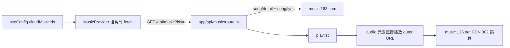
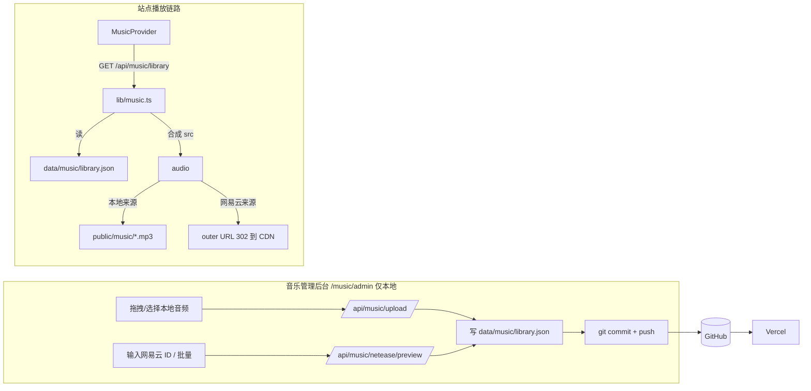

# EverlastingDemo 音乐模块优化与本地曲库编辑器实现策略

> **版本**：v1.0 | **日期**：2026-08-05
> **一句话目标**：把音乐模块从"硬编码网易云 ID + 无错误处理播放器"升级为"本地曲库单一数据源 + 本地音乐管理后台 + 可靠播放器"，并补齐音量系统、媒体键、快捷键、歌词与播放体验优化。
>
> **本策略包含**：
> 1. 现状盘点与实测证据（2026-08-05 对照仓库代码逐一核实）；
> 2. 本地音乐管理后台（editor 类似形式、仅本地可写）完整设计：本地音频上传 + 网易云 ID 导入；
> 3. 播放器核心优化与新增功能清单（含优先级）；
> 4. **音量键调试专项**（浏览器能力边界、改造方案、调试方法）；
> 5. 分期实施计划、风险对策与验收标准。

---

## 一、现状盘点

### 1.1 代码地图

| 文件 | 职责 | 关键现状 |
|------|------|----------|
| `siteConfig.ts` | 全局配置 | `cloudMusicIds: string[]` 硬编码 4 个网易云 ID，加歌必须改代码 + 部署 |
| `app/api/music/route.ts` | 网易云代理 | `GET ?ids=` 逐曲请求 detail + lyric，返回 `url`（outer 外链）；无缓存、无音频可用性校验 |
| `components/MusicProvider.tsx` | 全局播放状态 | 持有 `playlist/currentIndex/isPlaying/progress/volume/muted/playMode`；`<audio>` 元素；音量/静音/模式存 localStorage；有 `parseLrc` |
| `app/music/page.tsx` + `MusicClient.tsx` | 音乐详情页 | 歌词/歌单双 Tab、歌单搜索、进度条、桌面端音量滑杆（hover 展开） |
| `components/CloudPlayer.tsx` | 首页云乐盒 | 打字机歌词、进度条、播放/切歌；整卡点击跳转 `/music` |
| `components/FloatingPlayer.tsx` | 全局悬浮迷你播放器 | 可拖拽，桌面端显示，首页隐藏 |
| `components/LyricBar.tsx` / `SidebarLyric.tsx` | 歌词条/侧栏 | 打字机歌词；LyricBar 有伪波形动画 |
| `app/layout.tsx` | 根布局 | `MusicProvider` 全局包裹；FloatingPlayer 仅 `md+` |
| `lib/autopush.ts` | 自动推送 | 目前只提交 `notes/` 与 `public/uploads/notes` |

### 1.2 当前数据流



### 1.3 关键接口实测（2026-08-05，本机网络）

| 测试项 | 结果 | 结论 |
|--------|------|------|
| `song/media/outer/url?id=1441758494.mp3`（当前库 4 首） | 全部 `302` → `m*.music.126.net` CDN；跟随跳转后 `200 audio/mpeg`，约 3.2MB（128kbps 级） | 当前 4 首可播，但属于"签名临时外链 + 中间跳转"，非官方稳定 API |
| 无效 ID `123456789` | `302` → `http://music.163.com/404`，跟随后是 **200 的 HTML 页面** | 播放器 `<audio>` 拿到 HTML 会触发媒体错误——**当前代码没有任何 onError，表现就是"点了没反应/静默卡死"** |
| CDN 直链 Range 请求 | `206 audio/mpeg`，支持断点/seek | 说明 seek 依赖 CDN 层，跳转层（outer URL）本身不响应 Range |
| `api/song/detail` | 正常返回歌曲/歌手/封面 | 可用，属旧版接口 |
| `api/song/lyric` | `lrc` 正常；`tlyric`/`yrc` 可能为空 | 翻译歌词、逐字歌词**字段已存在但当前代码完全没使用** |

> 结论：网易云外链"能播但不保证"，且失败模式是 200 HTML，必须靠**导入时校验 + 播放时错误兜底**双保险。

---

## 二、问题诊断（按优先级）

### P0 阻断级（先修）

| # | 问题 | 位置 | 影响 |
|---|------|------|------|
| 1 | `<audio>` 无 `onError`，且外链失败返回 200 HTML | `MusicProvider` | 坏歌静默卡死，无提示、无自动跳歌 |
| 2 | 曲库硬编码 `siteConfig.cloudMusicIds` | `siteConfig.ts` | 加歌=改代码+重新部署；无法放本地文件 |
| 3 | 音量滑杆 `hidden md:flex` | `MusicClient.tsx` | **移动端完全没有音量控制** |
| 4 | 无加载/缓冲反馈（`onWaiting`/`onCanPlay` 未处理） | `MusicProvider` | 慢网/缓冲时 UI 无反馈 |

### P1 体验级（本轮做）

| # | 问题 | 说明 |
|---|------|------|
| 5 | 播放队列/进度不持久化 | 刷新丢当前曲目与进度（音量/静音/模式已持久化） |
| 6 | 无 Media Session | 锁屏、系统媒体键、耳机键全部不可用 |
| 7 | 无键盘快捷键 | 空格/方向键/音量键均无效 |
| 8 | 歌词只解析 lrc | `tlyric`（翻译）、`yrc`（逐字）被丢弃 |
| 9 | 无下一首预加载 | 切歌等待网络，体验断裂 |
| 10 | 进度条无缓冲指示 | 只有播放进度 |
| 11 | 音量交互别扭 | hover 才出现滑杆、双击静音不直观、触屏无 hover |
| 12 | `/api/music` 每次进入页面都重新请求 detail/lyric | 无缓存、无离线降级 |
| 13 | `lib/autopush.ts` 不覆盖 `data/music`、`public/music` | 音乐管理后台保存后无法自动推 GitHub |

### P2 功能级（后续迭代，见第八章清单）

喜欢/收藏、播放历史、频谱可视化、睡眠定时、音质选择、多歌单、ID3 标签自动读取等。

---

## 三、设计目标与原则

| 原则 | 含义 |
|------|------|
| 曲库即文件 | `data/music/library.json` 是唯一权威数据，播放器/管理后台/API 都从它读取；管理后台保存=写文件 |
| 本地优先 | 管理后台与写接口仅本地 `dev` 可用（复用编辑器 `NODE_ENV` 判断 + `EDITOR_TOKEN`），生产只读 |
| 双来源统一模型 | 本地文件与网易云 ID 统一为 `Track` 模型，播放器不感知来源差异 |
| 失败可感知 | 导入时校验音频可用性；播放时 `onError` 自动跳歌 + 提示，杜绝静默卡死 |
| 复用现有基建 | 复用 `autopush` 自动推送、`ToastProvider`、`EditorReadonly` 只读模式、玻璃拟态样式体系 |

---

## 四、总体架构



---

## 五、本地曲库编辑器（核心新功能）

### 5.1 数据模型：`data/music/library.json`

```json
{
  "version": 1,
  "tracks": [
    {
      "id": "netease-1441758494",
      "source": "netease",
      "neteaseId": "1441758494",
      "title": "晚风",
      "artist": "Copy",
      "album": "晚风",
      "cover": "https://p1.music.126.net/...",
      "lyrics": {
        "lrc": "[00:00.00] 晚风...",
        "tlyric": "",
        "yrc": null
      },
      "order": 1,
      "addedAt": "2026-08-05T12:00:00+08:00"
    },
    {
      "id": "local-20260805-my-song",
      "source": "local",
      "file": "music/20260805-my-song.mp3",
      "title": "我的歌",
      "artist": "佚名",
      "album": "",
      "cover": "",
      "lyrics": null,
      "order": 2,
      "addedAt": "2026-08-05T12:05:00+08:00"
    }
  ]
}
```

字段说明：

| 字段 | 必填 | 说明 |
|------|------|------|
| `id` | 是 | `netease-{id}` / `local-{slug}`，全局唯一，`^[a-z0-9-]+$` |
| `source` | 是 | `netease`（网易云外链）或 `local`（`public/music` 本地文件） |
| `neteaseId` | source=netease | 网易云歌曲数字 ID |
| `file` | source=local | 相对 `public/` 的路径，如 `music/20260805-my-song.mp3` |
| `title/artist/album/cover` | title 必填 | 展示用；网易云导入时自动抓取，本地可手填/ID3 自动读 |
| `lyrics` | 否 | `{ lrc, tlyric, yrc }`；**导入时抓取并落盘**，播放时不再实时请求 |
| `order` | 是 | 播放列表排序；后台上下移/拖拽调整 |

### 5.2 数据层：`lib/music.ts`

新文件，仿照 `lib/notes.ts` 的结构：

| 函数 | 职责 |
|------|------|
| `getLibrary()` | 读 `data/music/library.json`，校验、按 `order` 排序，带容错（坏文件跳过并告警） |
| `saveLibrary(lib)` | 写回磁盘（pretty JSON），失效缓存 |
| `validateTrack(t)` | 校验必填字段、id 正则、来源一致性，返回错误数组 |
| `composeTrack(t)` | 把库内 Track 合成播放器用的运行时 Track：网易云→`src=https://music.163.com/song/media/outer/url?id={neteaseId}.mp3`；本地→`src=/{file}` |
| `toPublicTracks()` | 供 `/api/music/library` 返回（去掉内部字段） |
| `generateLocalId(title)` | 生成 `local-{yyyyMMdd}-{slug}` |
| `checkAudioUrl(url)` | 用 `Range: bytes=0-0` 跟随跳转校验：`Content-Type` 以 `audio/` 开头即可用（详见 5.8） |

### 5.3 API 设计

| 路由 | 方法 | 用途 | 鉴权 | 说明 |
|------|------|------|------|------|
| `/api/music/library` | GET | 播放器读取曲库 | 公开 | 返回 `{ version, tracks }`，src 已合成 |
| `/api/music/library` | POST | 新增曲目 | 本地+Token | `source:netease` 时服务端抓元数据/歌词/校验音频；`source:local` 时文件必须已上传 |
| `/api/music/library` | PUT | 更新/排序 | 本地+Token | 元数据 patch 或 `{ id, order }` |
| `/api/music/library` | DELETE | 删除曲目 | 本地+Token | 可选 `deleteFile:true` 连带删除本地音频 |
| `/api/music/upload` | POST | 上传本地音频 | 本地+Token | multipart；校验扩展名/大小/文件名，写入 `public/music/` |
| `/api/music/netease/preview` | GET | 网易云 ID 预览 | 本地+Token | 返回详情+歌词+音频可用性，**不写库**，供后台确认 |
| `/api/music` | GET | 旧接口（ids 批量） | 公开 | 兼容期保留，阶段 3 结束后移除 |

鉴权与本地限定完全复用编辑器模式：

```ts
const isProd = process.env.NODE_ENV === "production";
function forbidWrites() { return NextResponse.json({ error: "生产环境只读：请在本地运行 npm run dev 使用音乐管理后台" }, { status: 403 }); }
function checkAuth(req: NextRequest): boolean {
  const token = process.env.EDITOR_TOKEN;
  if (!token) return true;
  return req.headers.get("authorization") === `Bearer ${token}`;
}
```

### 5.4 本地文件存储与 git 策略

- 上传目录：`public/music/`，命名 `yyyyMMdd-{slug}.{ext}`（扩展名白名单：`.mp3/.m4a/.flac/.ogg/.wav`）。
- 大小上限：默认 50MB，`MUSIC_MAX_MB` 环境变量可调；超过返回 413。
- git 策略（二选一，默认 A）：
  - **A. 提交入库（推荐个人站）**：`public/music/` 随 `autopush` 一并提交，部署后即用。注意 GitHub 单文件 100MB 上限，建议个人曲库控制在几百 MB 内。
  - **B. 不入库**：`.gitignore` 忽略 `public/music/*`（保留 `.gitkeep`），生产环境需另行上传（Vercel Blob/CDN/手动 rsync）。通过 `MUSIC_COMMIT_FILES=0` 控制。
- 校验与清理：上传前 `file` 类型检查 + 魔数嗅探（MP3 ID3/`0xFFFB` 帧头等），防伪装文件。

### 5.5 前端页面：`/music/admin`

路由：`app/music/admin/page.tsx`（生产环境返回 `EditorReadonly` 同类只读提示）+ `components/MusicAdminClient.tsx`。

页面结构：

```text
/music/admin
├─ 曲库列表
│  ├─ 封面缩略图 + 标题/歌手 + 来源徽标（网易云/本地）+ 状态（可播/不可用）
│  ├─ 排序（↑/↓ 或拖拽）、编辑、删除
│  └─ 顶部"保存并推送"状态条（同编辑器，实时显示 autopush 结果）
├─ Tab：添加方式
│  ├─ 本地文件：拖拽/文件选择 → 上传 → 预填标题/歌手（文件名启发式 `歌手 - 歌名.mp3`，可选 ID3 读取）→ 加入列表
│  └─ 网易云 ID：输入一个或多个 ID（逗号分隔）→ 预览卡片（封面/标题/歌手/歌词片段/音频可用性）→ 确认加入
└─ 编辑抽屉：标题/歌手/专辑/封面 URL/歌词文本域（LRC）
```

交互约定：
- 所有增删改**即时写盘**并触发一次 `autopushMusic`，页面上方显示 `push 成功/失败原因`（失败原因截断 200 字符，同现有 `PushResult`）。
- 删除本地文件二次确认，文案提示"文件将从 `public/music` 删除（如已提交可在 git 历史恢复）"。

### 5.6 自动化工作流

扩展 `lib/autopush.ts`，把"固定 targets"参数化：

```ts
// 新增导出，保留 autopushNotes 兼容
export async function autopush(targets: string[], message: string): Promise<PushResult>
export const autopushMusic = (message: string) =>
  autopush(["data/music", "public/music", "public/uploads/music"], message);
```

完整链路：**管理后台保存 → 写 `library.json`/上传文件 → `git add` 指定目录 → `git commit` → `git push origin HEAD` → Vercel 重新构建**。与笔记编辑器完全一致，`AUTO_PUSH=0` 可关闭。

可选扩展（后续）：CI 阶段跑 `node scripts/validate-music.mjs` 校验 `library.json` schema 与本地文件存在性，失败则构建失败（仿 `validate-notes.mjs`）。

### 5.7 网易云导入细节

导入时执行三步：

1. **元数据**：`api/song/detail/?id={id}&ids=[{id}]` 取名称/歌手/专辑/封面。
2. **歌词**：`api/song/lyric?id={id}&lv=-1&kv=-1&tv=-1` 取 `lrc`，同时保留 `tlyric`、`yrc`（为空则 null）；**落盘缓存**，播放器不再实时请求。
3. **音频可用性校验**：对 `https://music.163.com/song/media/outer/url?id={id}.mp3` 发 `GET` + `Range: bytes=0-0`（带 `User-Agent`/`Referer: https://music.163.com/`，跟随跳转）。判定规则：
   - 最终 `Content-Type` 以 `audio/` 开头 → 可用；
   - 最终是 HTML/404（当前实测无效 ID 的行为）→ 标记 `audioOk: false`，后台给出"该歌曲可能下架/VIP 受限，仍要加入吗？"提示（用户可强制加入，播放器错误兜底会跳歌）。

批量：ID 列表并发 3~5 个，避免触发风控；失败项单独列出不阻断整体。

---

## 六、播放器核心优化

### 6.1 状态机与错误处理（P0）

在 `MusicProvider` 增加：

```ts
const [failedIds, setFailedIds] = useState<string[]>([]);
const [isWaiting, setIsWaiting] = useState(false);

const handleError = () => {
  // 同一首歌最多连续失败 3 次，防止坏歌循环
  // 加入 failedIds → 自动 nextSong() → toast "该歌曲暂时无法播放，已自动跳过"
};
```

`<audio>` 绑定 `onError={handleError}`、`onWaiting={() => setIsWaiting(true)}`、`onPlaying={() => setIsWaiting(false)}`、`onCanPlay={() => setIsWaiting(false)}`。UI 在 `isWaiting` 时显示缓冲动画。

### 6.2 预加载与缓冲指示（P1）

- 下一首预加载：播放中且非随机模式时，用隐藏 `new Audio(nextSrc).preload = "metadata"` 预热（或 `<link rel="preload" as="audio">`）。
- 缓冲进度：`audio.buffered` 取最后一段 `buffered.end(length-1)`，进度条底色绘制缓冲段。

### 6.3 播放队列持久化（P1）

localStorage 键 `everlasting-music-state`：

```ts
{ playlistIds: string[], index: number, currentTime: number, updatedAt: number }
```

进入页面时：若 `playlistIds` 与当前曲库 id 顺序一致则恢复 `index + currentTime`；不一致（曲库改过）则丢弃。防抖写入（2s）。

### 6.4 播放模式增强（P1）

现有 `loop/single/random` 保留，新增 `order`（顺序播完即停，播完触发 `stop` 状态与 Media Session `playbackState = "none"`）。切歌按钮在 `order` 模式下末尾禁用。

### 6.5 歌词增强（P1）

- 解析器升级：`parseLrc` 支持多时间戳、`mm:ss.xx/xxx` 两种精度（现有代码两种写法并存，统一为一个解析器）；
- `tlyric` 翻译：歌词面板加"原文/译文/双语"切换（双语=上行原文下行译文）；
- `yrc` 逐字：可选解析器 `parseYrc`（JSON 时间轴），实现逐字高亮，作为 P2；
- 歌词空降级：无歌词时显示 `currentLyric` 打字机（保留现状）。

### 6.6 媒体键与系统集成：Media Session（P1）

新建 `components/useMediaSession.ts`，在 `currentSong/isPlaying/currentTime/duration` 变化时同步：

```ts
if ("mediaSession" in navigator) {
  navigator.mediaSession.metadata = new MediaMetadata({ title, artist, album, artwork });
  const safe = (action: MediaSessionAction, fn: () => void) => {
    try { navigator.mediaSession.setActionHandler(action, fn); } catch { /* 不支持则忽略 */ }
  };
  safe("play", togglePlay);
  safe("pause", togglePlay);
  safe("nexttrack", nextSong);
  safe("previoustrack", prevSong);
  safe("seekbackward", () => seekBy(-10));
  safe("seekforward", () => seekBy(10));
  safe("seekto", (d) => seekTo(d.seekTime ?? 0));
  safe("stop", () => { audio.pause(); audio.currentTime = 0; });
  navigator.mediaSession.playbackState = isPlaying ? "playing" : "paused";
  if (duration && "setPositionState" in navigator.mediaSession) {
    navigator.mediaSession.setPositionState({ duration, playbackRate: 1, position: currentTime });
  }
}
```

> 注意：`seekto` 等动作在部分浏览器会抛 `TypeError`（非法 action），必须 try/catch 逐个注册。作用：锁屏/通知栏显示封面与进度，耳机/系统媒体键可控制。

### 6.7 键盘快捷键（P1）

新建 `useKeyboardShortcuts`：

| 按键 | 动作 |
|------|------|
| `Space` | 播放/暂停（`preventDefault`） |
| `←` / `→` | 快退/快进 5s |
| `↑` / `↓` | 音量 +-0.05 |
| `M` | 静音切换 |
| `N` / `P` | 下一首/上一首 |

输入框/文本域/`contentEditable` 聚焦时全部忽略。

---

## 七、音量键调试专项（重点）

### 7.1 现状问题（代码审查结论）

| # | 问题 | 位置 |
|---|------|------|
| 1 | 音量滑杆 `hidden md:flex`，**移动端/窄屏无任何音量控制** | `MusicClient.tsx` |
| 2 | 滑杆靠 `onMouseLeave` 收起，触屏没有 hover，无法展开 | 同上 |
| 3 | 单击音量图标=展开滑杆，双击=静音，**交互不一致且不直观** | 同上 |
| 4 | `setVolume(0)` 后未同步 `muted`；部分浏览器（含 Safari）把音量拉到 0 会自动置 `muted=true`，UI 与 `audio` 状态失步 | `MusicProvider.tsx` |
| 5 | iOS Safari 禁止 JS 修改 `audio.volume`（读取恒为 1），当前代码无降级 | `MusicProvider.tsx` |
| 6 | 无键盘快捷键、无滚轮调音量、无音量渐变（切歌/恢复播放无淡入，可能爆音） | 全局 |

### 7.2 浏览器能力边界（先搞清楚"音量键"能做什么）

1. **系统音量键（键盘 Fn+F11/F12、耳机音量键）控制的是操作系统音量，浏览器页面收不到任何事件**，也无法用 JS 拦截——这是平台限制，不是 bug。
2. **Media Session API 不提供 volume 动作**。它只支持 `play/pause/stop/seekbackward/seekforward/seekto/previoustrack/nexttrack/skipad` 等传输控制；"媒体键"指播放/切歌/跳转，不含音量。
3. **iOS Safari**：`audio.volume` 只读（写无效，读回 1）；`audio.muted` 可写。需要特性检测降级。
4. 浏览器自动播放策略：带声音的播放必须由用户手势触发（`play()` Promise 失败要捕获），这也常被误报为"音量问题"。

结论：**"音量键调试"的落地范围 = 页面内快捷键/滑杆/滚轮 + 系统媒体键（Media Session 传输键）+ 平台降级处理**。

### 7.3 音量系统改造方案

**（1）状态单一来源 + 事件同步**

`volume(0~1)` 与 `muted` 由 React state 唯一持有，`audio.volumechange` 事件回调回写 state，防止原生控件/系统行为改状态后 UI 失步：

```ts
useEffect(() => {
  const el = audioRef.current;
  if (!el) return;
  const sync = () => setVolumeState(el.volume);
  el.addEventListener("volumechange", sync);
  return () => el.removeEventListener("volumechange", sync);
}, []);
```

**（2）音量/静音联动规则表**

| 用户操作 | volume state | muted state | audio 实际 |
|----------|-------------|-------------|------------|
| 滑杆拖到 >0 | v | `false` | `volume = v` |
| 滑杆拖到 0 | 0 | `true` | `muted = true` |
| 点击静音图标 | 不变 | 翻转 | `muted = 1 - muted`（记住旧音量） |
| 系统/原生把音量拉到 0 | 回写 0 | `true` | `muted = true` |
| 系统音量恢复 | 回写 v | 跟随 | 正常播放 |

**（3）移动端**

滑杆从"hover 展开"改为"点击图标展开浮层（AnimatePresence）+ 常驻窄条（可选）"，并在 `/music` 页与浮动播放器都可用；触屏 `onTouchEnd` 外点关闭。

**（4）iOS 降级**

挂载后一次性特性检测：

```ts
function detectVolumeSupport(audio: HTMLAudioElement): boolean {
  audio.volume = 0.3;
  return Math.abs(audio.volume - 0.3) < 0.001;
}
```

不支持时：隐藏滑杆、只保留静音按钮；进阶方案（可选 P2）用 Web Audio API `GainNode` 做软件音量。

**（5）平滑与防爆音**

播放/恢复时 150ms 淡入（从 `muted ? 0 : volume` 渐变到目标），暂停/切歌时 80ms 淡出；实现上在切换后分 5~8 步写入 `audio.volume`。

**（6）滚轮调音量（桌面）**

音量图标上 `onWheel`：向上 `+0.05`、向下 `-0.05`（`preventDefault`，`deltaY<0` 判断方向）。

### 7.4 调试方法与工具

**调试面板（开发模式）**：在 `MusicProvider` 中暴露 `window.__musicDebug`，显示：

```text
volume / muted / playbackRate / readyState / networkState
buffered: 0s~12.3s / duration: 240s
error: null | MEDIA_ERR_SRC_NOT_SUPPORTED
mediaSession: supported | unsupported
playbackState: playing/paused
```

**验证脚本（DevTools Console）**：

```js
const audio = window.__musicDebug.audio;
audio.volume = 0.3; console.log("volume write test:", audio.volume); // iOS 返回 1
audio.addEventListener("volumechange", () => console.log("volumechange", audio.volume, audio.muted));
```

**浏览器工具**：

- Chrome DevTools → More tools → Media：查看 Media Session 动作与播放状态；
- Android：通知栏/锁屏媒体卡片 + 耳机媒体键；
- iOS：控制中心媒体卡片（长按可显示进度）。

**测试矩阵**：

| 平台 | 滑杆 | 静音 | 快捷键 | Media Session | 备注 |
|------|------|------|--------|---------------|------|
| Chrome/Edge（Win/macOS） | 支持 | 支持 | 支持 | 支持 | 系统音量键走 OS |
| Firefox | 支持 | 支持 | 支持 | 支持（需开启媒体控制） | |
| Safari（macOS） | 支持 | 支持 | 支持 | 支持 | |
| iOS Safari | 隐藏（降级） | 支持 | 部分 | 支持 | `volume` 只读 |
| Android Chrome | 支持 | 支持 | 部分 | 支持 | 通知栏控制 |
| 微信内置浏览器 | 支持 | 支持 | 无 | 无 | X5 内核差异 |

---

## 八、可新增功能清单（含优先级）

| 优先级 | 功能 | 说明 | 依赖 |
|--------|------|------|------|
| P0 | 错误自动跳歌 | `onError` + 连续失败上限 | 6.1 |
| P0 | 本地曲库 + 管理后台 | 本次核心需求 | 第五章 |
| P1 | Media Session | 锁屏/系统媒体键/进度 | 6.6 |
| P1 | 键盘快捷键 | 空格/方向/音量/M/N/P | 6.7 |
| P1 | 播放队列持久化 | 恢复 index+进度 | 6.3 |
| P1 | 移动端音量控制 | 常驻浮层滑杆 | 7.3 |
| P1 | 歌词翻译 tlyric | 原文/译文/双语 | 6.5 |
| P1 | 预加载与缓冲指示 | 切歌预热 + buffered 渲染 | 6.2 |
| P2 | 喜欢/收藏 | localStorage `everlasting-music-favorites`，列表爱心标记 | - |
| P2 | 播放历史/最近播放 | 最近 50 首，跳转 | - |
| P2 | 频谱可视化 | Web Audio `AnalyserNode` 替换伪波形 | - |
| P2 | 睡眠定时器 | 播放 N 分钟后暂停 | - |
| P2 | 音质选择 | 依赖自建 NeteaseCloudMusicApi 的 `song/url/v1`（standard/exhigh/lossless） | 外部服务 |
| P2 | 网易云歌单同步 | 输入歌单 ID 批量拉取（`playlist/detail`）| 自建 API |
| P2 | ID3 标签自动读取 | 上传本地文件时读 title/artist/cover（`music-metadata` 可选依赖） | - |
| P2 | 歌词编辑 | 管理后台直接编辑 LRC 文本域 | 5.5 |
| P2 | 流式代理 `/api/music/stream` | 服务端带 Referer 转发 outer URL + Range，规避防盗链/跨域 | 见风险表 |
| P3 | 均衡器/淡入淡出/无缝播放 | Web Audio 增益 + 双 audio 预加载（gapless） | - |
| P3 | 离线缓存 | Service Worker 缓存已播音频（Cache API） | - |
| P3 | 播放统计/Last.fm scrobble | 可选 | 外部账号 |

---

## 九、分期实施计划

| 阶段 | 内容 | 产出 | 预计 |
|------|------|------|------|
| 0 | P0 修复：`onError` 跳歌、加载反馈、移动端音量、`setVolume`/`muted` 联动 | `MusicProvider`/`MusicClient` 补丁 | 0.5~1 天 |
| 1 | 数据层：`lib/music.ts`、`library.json` 初版（迁移现有 4 首）、`/api/music/library`、`validate-music` 脚本 | 曲库可读、播放器切到新数据源 | 1~2 天 |
| 2 | 管理后台：上传、网易云导入、CRUD、排序、autopush 扩展、只读保护 | `/music/admin` 完整可用 | 2~3 天 |
| 3 | 体验层：Media Session、快捷键、队列持久化、预加载/缓冲、歌词 tlyric | 播放器体验闭环 | 1~2 天 |
| 4 | 打磨：音量调试面板、测试矩阵、README/.env.example 更新、移除旧 `/api/music` | 收尾交付 | 1 天 |

每阶段结束跑 `npm run lint` + `npx tsc --noEmit`，并按 `.agents` 约定 commit + push。

---

## 十、风险与对策

| 风险 | 严重度 | 对策 |
|------|--------|------|
| 网易云接口非官方，随时可能失效/风控 | 高 | 导入时缓存元数据+歌词；播放失败自动跳歌；可选自建 NeteaseCloudMusicApi 增强（`song/url/v1`、歌单同步） |
| outer 外链临时签名、部分地区/歌曲 404 | 中 | `Range: bytes=0-0` 导入校验 + `audioOk` 标记；P2 提供 `/api/music/stream` 服务端代理（带 Referer 转发，支持 Range，可挂 `Cache-Control`） |
| 本地音频入库导致仓库膨胀 | 中 | 默认 50MB 上限；`MUSIC_COMMIT_FILES=0` 可选不入库；GitHub 单文件 100MB 硬限制写进后台提示 |
| 生产环境文件系统只读 | 中 | 写接口与后台一律 `NODE_ENV` 拦截，生产展示只读提示（复用 EditorReadonly 模式） |
| 歌词接口返回空（tlyric/yrc） | 低 | 空则 null，UI 优雅降级 |
| 版权合规 | 中 | 管理后台仅本地面向站主；不提供公开下载接口；文档声明个人使用 |

---

## 十一、验收标准

1. `/music/admin` 在 `npm run dev` 下可用：上传本地音频、输入网易云 ID、预览、加入/编辑/删除/排序均即时写盘；
2. 保存后自动 `git commit + push`，远端 `git log` 可见（`AUTO_PUSH=0` 时跳过并提示）；
3. 生产构建下 `/music/admin` 只读提示，写接口返回 403；
4. 播放器坏歌自动跳歌并 toast，连续 3 次失败不循环；
5. 移动端可调音量；iOS 隐藏滑杆、静音可用；
6. 桌面快捷键与 Media Session 动作全部生效（按 7.4 测试矩阵验收）；
7. 刷新页面恢复播放队列与进度；
8. `npm run lint`、`npx tsc --noEmit` 通过；
9. README 路由表与环境变量说明更新。

---

## 附录 A：复用与扩展点

- `EditorReadonly`：管理后台生产只读页直接复用或仿写；
- `lib/autopush.ts`：参数化 targets 后同时服务 notes/music；
- `ToastProvider`：保存/推送/错误提示复用；
- `scripts/validate-notes.mjs`：仿写 `validate-music.mjs`；
- `.env.example` 新增：`MUSIC_MAX_MB`、`MUSIC_COMMIT_FILES`（可选 `NETEASE_API_BASE` 指向自建 NeteaseCloudMusicApi）。

## 附录 B：参考

- MDN Media Session API：`https://developer.mozilla.org/en-US/docs/Web/API/Media_Session_API`
- MDN `MediaSession.setActionHandler()`（动作列表与兼容性）
- NeteaseCloudMusicApi（Binaryify，自建 `song/url/v1` 参考）：`https://github.com/Binaryify/NeteaseCloudMusicApi`
- HTMLAudioElement `volume`/`muted` 兼容性（iOS Safari 只读 volume）
