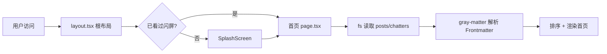
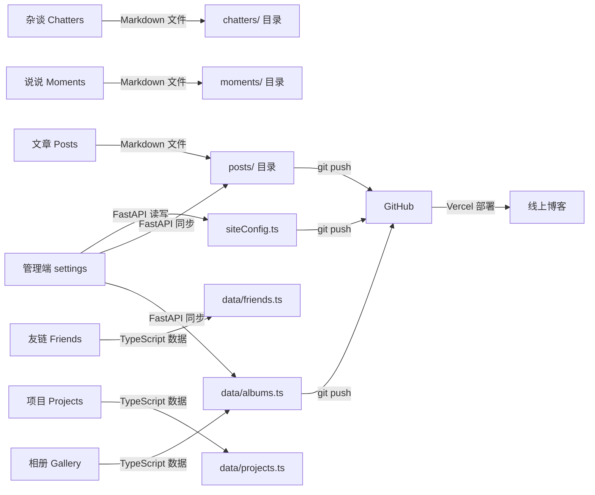
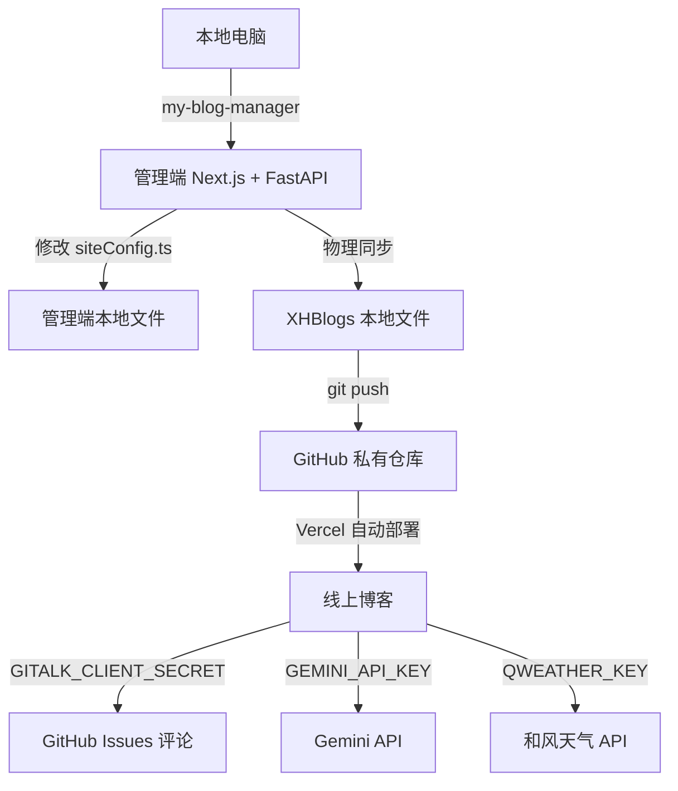

# XHBlogs 项目分析指南

> **分析模式：浅层分析** | 分析时间：2026-08-03 | 项目规模：中型（约 286 文件）

---

## 一、项目定位

XHBlogs 是一个基于 **Next.js 16** 构建的高颜值毛玻璃（Glassmorphism）风格个人博客系统。由 **前端展示（XHBlogs）** + **本地后台控制台（my-blog-manager）** + **Python FastAPI 后端（cms_core）** 三部分组成，支持 Markdown 沉浸式写作、草稿管理、图床配置、AI 猫猫助理、评论系统、网易云音乐挂件等功能。

| 维度 | 详情 |
|------|------|
| 项目类型 | 个人博客系统（前后端分离 + 本地 CMS） |
| 部署方式 | Vercel（前端静态） + 本地 Electron/浏览器（管理端） |
| 许可证 | CC BY-NC 4.0（非商业使用） |
| 版本 | 0.3.1 ~ 0.3.2 |

---

## 二、技术栈

### 前端博客（XHBlogs）

| 类别 | 技术 | 版本 |
|------|------|------|
| 框架 | Next.js (App Router) | 16.2.1 |
| UI 库 | React | 19.2.4 |
| 样式 | Tailwind CSS | v4 |
| 排版 | @tailwindcss/typography | 0.5.19 |
| 动画 | Framer Motion | 12.38.0 |
| 3D 渲染 | Three.js (@react-three/fiber + drei) | 0.184.0 |
| Markdown | unified + remark + rehype 生态 | v11 |
| 数学公式 | KaTeX | 0.16.45 |
| 代码高亮 | highlight.js + rehype-highlight | 11.11.1 |
| 富文本编辑器 | Tiptap | 3.20.5 |
| 评论系统 | Gitalk | 1.8.0 |
| 主题切换 | next-themes | 0.4.6 |
| AI 集成 | OpenAI SDK (兼容 Gemini) | 6.33.0 |
| 图标 | Lucide React | 1.7.0 |
| 类型检查 | TypeScript | v5 |
| 代码检查 | ESLint | v9 |

### 管理端（my-blog-manager）

管理端技术栈与前端**基本一致**，额外包含：

| 差异项 | 说明 |
|--------|------|
| Tiptap 扩展 | 增加 `@tiptap/extension-code-block-lowlight` + `lowlight` + `marked` + `tiptap-markdown`（Markdown 互转） |
| 后端 | Python FastAPI (`cms_core/`) |
| 启动器 | Python `launcher.py` + `run_me.py`（自动安装依赖 + 启动 Next.js + FastAPI） |

### Python 后端（cms_core）

| 类别 | 技术 |
|------|------|
| 框架 | FastAPI |
| 跨域 | CORSMiddleware |
| 功能模块 | 配置读写、图床、草稿、相册、友链、项目、说说、同步、部署 |

---

## 三、项目结构树

```text
XinghuisamaBlogs/                          ★ P0 - 项目根目录
├── README.md                              ★ P0 - 部署指南（中文）
├── README_en.md                                 - 英文版 README
├── UpdateLog.md                                 - 版本更新日志
├── LICENSE                                      - CC BY-NC 4.0
├── update.bat / update.py                       - 无损更新器脚本
├── picture/                                     - README 用截图
├── scripts/                                     - 辅助脚本
│
├── XHBlogs/                               ★ P0 - 【前端博客】Next.js 应用
│   ├── package.json                       ★ P0 - 依赖清单
│   ├── next.config.ts                           - Next.js 配置（SSR 模式，非静态导出）
│   ├── tsconfig.json                            - TypeScript 配置
│   ├── postcss.config.mjs                       - PostCSS 配置
│   ├── eslint.config.mjs                        - ESLint 配置
│   ├── siteConfig.ts                      ★ P0 - 全站配置中心（单文件控制所有内容）
│   ├── app/                               ★ P0 - Next.js App Router 页面
│   │   ├── layout.tsx                     ★ P0 - 根布局（主题、音乐、特效、闪屏）
│   │   ├── page.tsx                       ★ P0 - 首页（服务端渲染，读取 posts/chatters）
│   │   ├── globals.css                          - 全局样式
│   │   ├── about/                              🟡 - 关于页面
│   │   ├── posts/[slug]/                  ★ P0 - 文章详情页（动态路由）
│   │   ├── chatter/[slug]/                ★ P0 - 杂谈详情页（动态路由）
│   │   ├── moments/                       ★ P1 - 说说/碎碎念
│   │   ├── friends/                             - 友链页面
│   │   ├── music/                               - 音乐播放器页面
│   │   ├── photowall/                           - 照片墙/画廊
│   │   ├── projects/                            - 项目展示
│   │   ├── timeline/                            - 时间线/归档
│   │   ├── tree/                                - 目录树页面
│   │   └── api/                           ★ P0 - API 路由（Next.js 服务端）
│   │       ├── chat/route.ts                    - Gemini AI 对话代理
│   │       ├── music/route.ts                   - 网易云音乐 API 代理
│   │       ├── weather/route.ts                 - 和风天气 API 代理
│   │       ├── github/route.ts                  - GitHub OAuth 代理（Gitalk）
│   │       └── test/route.ts                    - 测试端点
│   ├── components/                        ★ P0 - React 组件库（38 个文件）
│   │   ├── Navbar.tsx                     ★ P0 - 导航栏（物理引擎旋转菜单）
│   │   ├── ProfileCard.tsx                      - 首页个人名片
│   │   ├── SiteDashboard.tsx                    - 首页数据仪表盘
│   │   ├── SearchBar.tsx                        - 搜索栏
│   │   ├── PageTransition.tsx                   - 页面过渡动画
│   │   ├── BackgroundEffects.tsx                - 背景粒子特效（Three.js）
│   │   ├── BackgroundSlider.tsx                 - 背景图片轮播
│   │   ├── DanmakuBackground.tsx                - 背景弹幕
│   │   ├── Sakura.tsx                           - 樱花飘落特效
│   │   ├── Fireflies.tsx                        - 萤火虫特效
│   │   ├── GlobalSnow.tsx                       - 全局飘雪
│   │   ├── WindyGrass.tsx                       - 风吹草动特效
│   │   ├── WeatherEffect.tsx                    - 天气特效
│   │   ├── WeatherWidget.tsx                    - 天气小部件
│   │   ├── ClickEffect.tsx                      - 点击波纹特效
│   │   ├── CyberCat.tsx                   ★ P0 - AI 猫猫助理（对话 + 喂食）
│   │   ├── FloatingPlayer.tsx             ★ P0 - 全局浮动音乐播放器
│   │   ├── MusicPlayer.tsx                      - 音乐播放器页面组件
│   │   ├── CloudPlayer.tsx                      - 首页云音乐展示
│   │   ├── MusicProvider.tsx              ★ P0 - 音乐上下文 Provider
│   │   ├── LyricBar.tsx                         - 歌词滚动条
│   │   ├── SidebarLyric.tsx                     - 侧边栏歌词
│   │   ├── Comments.tsx                   ★ P0 - Gitalk 评论组件
│   │   ├── LabComments.tsx                      - 实验室评论（备用）
│   │   ├── MomentComments.tsx                   - 说说评论
│   │   ├── LatestPostsCarousel.tsx              - 最新文章轮播
│   │   ├── LatestChatterCarousel.tsx            - 最新杂谈轮播
│   │   ├── ClientTOC.tsx                        - 文章目录导航
│   │   ├── ClientSocials.tsx                    - 社交链接
│   │   ├── TimelineClient.tsx                   - 时间线客户端组件
│   │   ├── TimelineNode.tsx                     - 时间线节点
│   │   ├── AboutClient.tsx                      - 关于页面客户端组件
│   │   ├── ThemeProvider.tsx              ★ P0 - 主题 Provider
│   │   ├── ThemeToggleBlock.tsx                 - 主题切换按钮
│   │   ├── SplashScreen.tsx                     - 启动闪屏动画
│   │   ├── GlobalToolbox.tsx                    - 全局工具箱（计算器等）
│   │   ├── ToastProvider.tsx                    - Toast 通知 Provider
│   │   ├── BackButton.tsx                       - 返回按钮
│   │   └── MobileBackButton.tsx                 - 移动端返回按钮
│   ├── data/                             ★ P1 - 静态数据（由管理端生成）
│   │   ├── albums.ts                           🟡 - 相册数据
│   │   ├── friends.ts                          🟡 - 友链数据
│   │   └── projects.ts                         🟡 - 项目数据
│   ├── posts/                            ★ P0 - Markdown 文章目录
│   ├── chatters/                         ★ P0 - Markdown 杂谈目录
│   ├── moments/                          ★ P0 - Markdown 说说目录
│   └── public/                                 - 静态资源（CNAME, SVG, 图片, 3D 模型）
│
└── my-blog-manager/                      ★ P0 - 【管理控制台】Next.js + FastAPI
    ├── package.json                      ★ P0 - 依赖清单
    ├── Start.bat                               - Windows 一键启动脚本
    ├── launcher.py                             - Python 启动器（装依赖 + 启动前后端）
    ├── run_me.py                               - 依赖检查 + 自动安装
    ├── window_config.json                      - Electron 窗口配置（1920x1080）
    ├── siteConfig.ts                     ★ P0 - 全站配置（与 XHBlogs 同步覆盖）
    ├── cms_core/                         ★ P0 - Python FastAPI 后端
    │   ├── main.py                       ★ P0 - FastAPI 入口（注册 10 个路由模块）
    │   └── api/                                - API 路由模块
    │       ├── config.py                  ★ P0 - 配置读写（直接解析 siteConfig.ts）
    │       ├── sync.py                    ★ P0 - 物理同步（覆盖 posts/chatters/data 到 XHBlogs）
    │       ├── deploy.py                  ★ P0 - Git 部署（SSH 密钥 + Git init/push）
    │       ├── drafts.py                        - 草稿管理
    │       ├── moments.py                       - 说说管理
    │       ├── gallery.py                       - 相册管理
    │       ├── friends.py                       - 友链管理
    │       ├── projects.py                      - 项目管理
    │       ├── music.py                         - 音乐搜索
    │       └── picbed.py                        - 图床上传代理
    ├── app/                              ★ P0 - 管理端页面
    │   ├── layout.tsx                    ★ P0 - 根布局（含 OperationProvider）
    │   ├── admin/page.tsx                ★ P0 - 管理仪表盘（文章/草稿/画廊）
    │   ├── editor/                             - 富文本编辑器页面（Tiptap）
    │   ├── settings/page.tsx             ★ P0 - 系统核心配置页（11 个 Tab）
    │   ├── drafts/                             - 草稿管理
    │   ├── posts/[slug]/                       - 文章预览
    │   ├── ...                                  - 其他与 XHBlogs 对应页面
    │   └── api/                                - Next.js API 路由
    ├── components/                       ★ P1 - 管理端组件（与 XHBlogs 高度复用）
    │   ├── editor/                             - 编辑器专用组件
    │   │   ├── RichTextEditor.tsx         ★ P0 - Tiptap 富文本编辑器
    │   │   ├── EditorClient.tsx                 - 编辑器客户端外壳
    │   │   ├── FloatingImageTool.tsx            - 浮动图片工具栏
    │   │   └── MetaMatrix.tsx                   - 文章元数据编辑
    │   └── settings/                           - 设置页分 Tab 组件（11 个 Section）
    │       ├── ProfileSection.tsx         ★ P0 - 个人名片设置
    │       ├── BackgroundSection.tsx            - 背景设置
    │       ├── MusicSection.tsx                 - 音乐设置
    │       ├── GallerySection.tsx               - 画廊设置
    │       ├── RepoSection.tsx                  - 仓库/部署设置
    │       ├── DisplaySection.tsx               - 显示设置
    │       ├── CommentSection.tsx               - 评论设置
    │       ├── DanmakuSection.tsx               - 弹幕设置
    │       ├── FooterSection.tsx                - 页脚设置
    │       └── AICatSection.tsx                 - AI 猫猫设置
    ├── context/                                 - React Context
    │   └── OperationContext.tsx           ★ P0 - 操作暂存区（队列机制）
    └── data/                              ★ P1 - 管理端数据
        ├── deploy_config.json                   - 部署配置（blogPath + Git 仓库）
        ├── albums.ts                            - 相册数据
        ├── friends.ts                           - 友链数据
        └── projects.ts                          - 项目数据
```

---

## 四、入口点与核心流程

### 4.1 前端博客（XHBlogs）



**关键入口文件：**
- [XHBlogs/app/layout.tsx](XHBlogs/app/layout.tsx) — 根布局：主题 Provider、音乐 Provider、背景特效、闪屏逻辑、弹幕、AI 猫猫
- [XHBlogs/app/page.tsx](XHBlogs/app/page.tsx) — 首页：服务端组件，直接通过 `fs` 读取 `posts/` 和 `chatters/` 目录的 `.md` 文件，前端无须 API 调用
- [XHBlogs/siteConfig.ts](XHBlogs/siteConfig.ts) — 全站配置中心：博客标题、个人信息、社交链接、背景图片、音乐 ID、Gitalk 配置、AI 配置、弹幕列表、ICP 备案

### 4.2 内容数据流（已观察）

```text
┌─────────────────────────────────────────────────────────┐
│                   my-blog-manager                        │
│                                                         │
│  settings/page.tsx                                      │
│    │  用户修改配置                                        │
│    ▼                                                    │
│  OperationContext (暂存队列)                              │
│    │  "暂存到操作队列" → "更新本地"                         │
│    ▼                                                    │
│  FastAPI POST /api/config/update                        │
│    │  直接写入 siteConfig.ts 文件                          │
│    ▼                                                    │
│  FastAPI POST /api/sync/execute                         │
│    │  覆盖 XHBlogs/ 对应目录和文件                         │
│    ▼                                                    │
│  XHBlogs/posts/  XHBlogs/data/  XHBlogs/siteConfig.ts   │
│    │                                                    │
│  FastAPI POST /api/deploy/git-push                      │
│    │  git add + commit + push (source branch)            │
│    ▼                                                    │
│  GitHub → Vercel 自动构建部署                             │
└─────────────────────────────────────────────────────────┘
```

### 4.3 API 路由一览

| 端点 | 方法 | 位置 | 功能 |
|------|------|------|------|
| `/api/chat` | POST | XHBlogs | Gemini AI 对话代理（Edge Runtime） |
| `/api/music?ids=` | GET | XHBlogs | 网易云音乐详情 + 歌词代理 |
| `/api/weather` | GET | XHBlogs | 和风天气 API 代理 |
| `/api/github` | POST | XHBlogs | GitHub OAuth 代理（Gitalk 评论登录） |
| `/api/status` | GET | FastAPI | CMS 后端健康检查 |
| `/api/config/get` | GET | FastAPI | 读取 siteConfig.ts |
| `/api/config/update` | POST | FastAPI | 更新 siteConfig.ts |
| `/api/sync/check` | POST | FastAPI | 校验博客路径合法性 |
| `/api/sync/execute` | POST | FastAPI | 物理覆盖同步到 XHBlogs |
| `/api/deploy/config` | GET/POST | FastAPI | 部署配置读写 |
| `/api/deploy/git-push` | POST | FastAPI | Git 推送源码 |
| `/api/deploy/ssh/key` | GET | FastAPI | 获取/生成 SSH 部署密钥 |
| `/api/gallery/*` | CRUD | FastAPI | 相册管理 |
| `/api/friends/*` | CRUD | FastAPI | 友链管理 |
| `/api/projects/*` | CRUD | FastAPI | 项目管理 |
| `/api/drafts/*` | CRUD | FastAPI | 草稿管理 |
| `/api/moments/*` | CRUD | FastAPI | 说说管理 |
| `/api/music/search` | GET | FastAPI | 音乐搜索 |
| `/api/picbed/*` | POST | FastAPI | 图床上传代理 |

---

## 五、核心业务概念地图



- **文章/杂谈/说说** — 纯 Markdown 文件存储，前端通过 `fs` + `gray-matter` 服务端渲染，无数据库
- **相册/友链/项目** — TypeScript 数据文件（`data/*.ts`），由管理端 FastAPI 自动生成
- **siteConfig.ts** — 唯一的配置真相源，被 FastAPI 直接解析和覆写
- **同步机制** — FastAPI 将管理端的修改物理覆盖到 XHBlogs 对应文件，再通过 Git 推送触发 Vercel 部署

---

## 六、关键组件分析

### 6.1 导航栏（Navbar.tsx）

[已观察] 桌面端使用 **Framer Motion 物理引擎旋转菜单**（`useMotionValue` + `useSpring` + Pan 手势），拖拽旋转导航轮盘。移动端使用可拖拽浮动按钮。支持滚动隐藏/显示。

### 6.2 AI 猫猫助理（CyberCat.tsx）

[已观察] 右下角悬浮的暹罗猫交互组件，支持：
- **摸猫**：点击触发随机反馈语
- **喂小鱼干**：触发 Gemini API 对话
- **聊天输入**：自由对话

通过 `fetch('/api/chat')` 调用 Next.js Edge Runtime 代理，转发至 Gemini API（`gemini-2.5-flash-lite`），系统提示词配置在 `siteConfig.geminiConfig.systemPrompt`。

### 6.3 操作暂存区（OperationContext.tsx）

[已观察] 管理端的核心状态管理机制。用户在设置页的所有修改不直接写入文件，而是先 `addOperation` 推入队列，然后在顶部工具栏统一执行「更新本地」（调用 FastAPI config/update）→「同步 Blog」（调用 FastAPI sync/execute）。

### 6.4 物理同步（cms_core/api/sync.py）

[已观察] 同步逻辑：
- 目录级覆盖：`posts/`、`chatters/`、`moments/`（先清空后全量复制）
- 文件级覆盖：`app/about/about.md`、`data/albums.ts`、`data/friends.ts`、`data/projects.ts`、`siteConfig.ts`
- 安全防护：检查目标路径是否存在 `package.json`，防止误操作覆盖非博客目录

---

## 七、特效系统

项目大量使用视觉特效，按渲染方式分类：

| 特效组件 | 技术 | 说明 |
|----------|------|------|
| BackgroundEffects | Three.js (@react-three/fiber) | 粒子背景动画 |
| Sakura | CSS / Canvas | 樱花飘落 |
| Fireflies | CSS Animation | 萤火虫闪烁 |
| GlobalSnow | CSS Animation | 雪花飘落 |
| WindyGrass | SVG / CSS | 风吹草动 |
| ClickEffect | CSS Animation | 点击波纹扩散 |
| DanmakuBackground | CSS Animation | 背景弹幕滚动 |
| WeatherEffect | CSS Animation | 天气特效（雨/雪/晴） |
| BackgroundSlider | CSS Transition | 背景图片轮播 + 渐变流动 |
| SplashScreen | Framer Motion | 启动闪屏动画 |
| PageTransition | Framer Motion | 页面切换动画 |

> ⚠️ **移动端性能优化**（已观察）：部分高负载特效（粒子、弹幕）在移动端通过 CSS `hidden md:block` 隐藏。

---

## 八、部署架构



- **管理端**：本地运行（`Start.bat` → Python 启动器 → Next.js dev + FastAPI）
- **前端博客**：Vercel 部署（SSR 模式，API Routes 在 Vercel Edge/Serverless 运行）
- **敏感信息**：API Key 通过 Vercel Environment Variables 注入，不写入源码仓库

---

## 九、开发约定

### 9.1 命名规范

- **文件名**：PascalCase（组件）、camelCase（工具函数）、kebab-case 或日期前缀（Markdown 内容文件）
- **目录结构**：Next.js App Router 约定（`app/` 目录即路由）
- **组件分类**：页面级在 `app/`，可复用组件在 `components/`，设置子组件在 `components/settings/`

### 9.2 内容文件格式

Markdown 文件使用 YAML Frontmatter：
```yaml
---
title: 文章标题
date: 2026-03-25
description: 文章摘要
cover: 封面图URL
tags: [标签1, 标签2]
---
```

### 9.3 状态管理

- 前端博客：无全局状态库，通过 Context（ThemeProvider、MusicProvider、ToastProvider）传递
- 管理端：OperationContext（操作暂存区队列）为核心模式

### 9.4 样式方案

- Tailwind CSS v4 全局使用
- 毛玻璃效果：`bg-white/40 dark:bg-slate-900/40 backdrop-blur-xl border border-white/50`
- 主题色通过 `siteConfig.themeColors` 数组定义
- 深色模式通过 `next-themes` + `dark:` 选择器实现

---

## 十、快速导航索引

| 需求 | 关键文件 |
|------|----------|
| 修改博客基本信息 | [XHBlogs/siteConfig.ts](XHBlogs/siteConfig.ts) |
| 修改首页布局 | [XHBlogs/app/page.tsx](XHBlogs/app/page.tsx) |
| 修改根布局/全局特效 | [XHBlogs/app/layout.tsx](XHBlogs/app/layout.tsx) |
| 添加新页面 | [XHBlogs/app/](XHBlogs/app/) 新建目录 + `page.tsx` |
| 修改 AI 猫猫行为 | [XHBlogs/components/CyberCat.tsx](XHBlogs/components/CyberCat.tsx) + `siteConfig.geminiConfig` |
| 修改导航栏 | [XHBlogs/components/Navbar.tsx](XHBlogs/components/Navbar.tsx) |
| 修改音乐播放器 | [XHBlogs/components/FloatingPlayer.tsx](XHBlogs/components/FloatingPlayer.tsx) + [XHBlogs/components/MusicProvider.tsx](XHBlogs/components/MusicProvider.tsx) |
| 修改评论系统 | [XHBlogs/components/Comments.tsx](XHBlogs/components/Comments.tsx) + `siteConfig.gitalkConfig` |
| 修改管理端设置页 | [my-blog-manager/components/settings/](my-blog-manager/components/settings/) 对应 Section 组件 |
| 修改同步逻辑 | [my-blog-manager/cms_core/api/sync.py](my-blog-manager/cms_core/api/sync.py) |
| 修改部署逻辑 | [my-blog-manager/cms_core/api/deploy.py](my-blog-manager/cms_core/api/deploy.py) |
| 修改后台配置读写 | [my-blog-manager/cms_core/api/config.py](my-blog-manager/cms_core/api/config.py) |
| 添加新 API | [my-blog-manager/cms_core/api/](my-blog-manager/cms_core/api/) 新建模块 + [cms_core/main.py](my-blog-manager/cms_core/main.py) 注册路由 |
| 写新文章 | 在管理端编辑器撰写，或直接在 [XHBlogs/posts/](XHBlogs/posts/) 创建 `.md` 文件 |

---

## 十一、对你做个人博客的参考价值

### 可直接复用的设计模式

1. **siteConfig 单文件配置中心** — 所有可配置项集中在一个 TS 文件，前后端共享同一份配置，管理端通过文件解析实现可视化编辑
2. **Markdown 文件即内容** — 无需数据库，文章/杂谈/说说纯 Markdown 存储，`fs` + `gray-matter` 服务端渲染
3. **操作暂存区队列** — `OperationContext` 实现了修改预览 → 确认 → 批量写入的安全模式
4. **双轨同步** — 管理端（本地） → 物理同步 → 前端目录 → Git → Vercel 的完整内容发布管线
5. **API 代理层** — 敏感 API Key 通过 Next.js API Route 代理，前端不暴露密钥

### 建议保留的特性

- 🎨 毛玻璃设计风格 + 流动渐变背景
- 🐱 AI 助理组件（可替换为你自己的角色）
- 🎵 音乐播放器集成
- 💬 Gitalk 评论系统（基于 GitHub Issues）
- 📱 移动端适配 + 性能分级（桌面端全特效、移动端降级）
- 🌓 暗/亮主题切换

### 建议改进的方向

- siteConfig 直接解析 TS 文件的方式较脆弱，可改为 JSON 配置文件
- 管理端与前端大量组件代码重复，可抽取为共享包
- FastAPI 文件操作缺少事务保护，同步失败可能导致数据不一致
- 无埋点/分析系统（Google Analytics 等），可后期按需添加
- 无自动化测试

---

## 十二、证据标注说明

| 标签 | 含义 |
|------|------|
| **已观察** | 通过读取文件确认 |
| **文档声明** | README 等文档中写明 |
| **推断** | 由结构/命名/调用关系得出 |

> 本报告所有结论均基于对项目源码的直接读取。未执行 `npm install` 或 `npm run dev` 等运行时验证。
